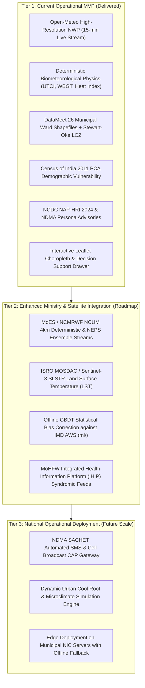

# ThermoShield India — SIH26083: Extreme Heatwave Early Warning & Biometeorological Decision Support System

**Ministry of Earth Sciences (MoES) / National Centre for Medium Range Weather Forecasting (NCMRWF)**  
**Category:** Software | **Theme:** Disaster Management | **Pan-India Coverage & Ward-Level Precision**

[](https://www.python.org/)
[](https://fastapi.tiangolo.com)
[](https://www.sqlalchemy.org/)
[-brightgreen.svg)](https://docs.pytest.org)
[](LICENSE)
[](docs/DATA_SOURCES.md)

---

## 🚀 Quick Start: Run Locally (One-Click Launch)

ThermoShield India includes an automated SQLite bootstrap requiring zero prior database configuration.

### Option A: Windows (Batch / PowerShell)
```cmd
# Run via batch file:
scripts\run_local.bat

# Or run via PowerShell:
.\scripts\run_local.ps1
```

### Option B: Cross-Platform (Python)
```bash
# 1. Clone repository
git clone https://github.com/Lovish-creator/sih-heat-risk.git
cd sih-heat-risk

# 2. Install dependencies
pip install -r requirements.txt

# 3. Run development server (FastAPI + Uvicorn)
python -m uvicorn backend.app.main:app --host 127.0.0.1 --port 8000
```

### Option C: Docker Compose
```bash
docker-compose up --build
```

---

## 🌐 Local Access Endpoints

Once launched, access the system immediately in your browser:

| Interface | Local URL | Description |
|:---|:---|:---|
| 🖥️ **Web Dashboard (UI)** | [http://127.0.0.1:8000](http://127.0.0.1:8000) | Interactive Leaflet choropleth map, biometeorological charts, and decision drawer |
| 📖 **Interactive Swagger UI** | [http://127.0.0.1:8000/docs](http://127.0.0.1:8000/docs) | OpenAPI interactive documentation and live endpoint testing sandbox |
| 📑 **ReDoc API Spec** | [http://127.0.0.1:8000/redoc](http://127.0.0.1:8000/redoc) | Clean, searchable REST API technical reference |
| 🩺 **System Health Check** | [http://127.0.0.1:8000/health](http://127.0.0.1:8000/health) | Real-time database connectivity and environment health endpoint |
| ⏱️ **Data Freshness** | [http://127.0.0.1:8000/api/v1/data-freshness](http://127.0.0.1:8000/api/v1/data-freshness) | Atmospheric telemetry status across upstream data providers |
| 🗺️ **GIS Ward Risk GeoJSON** | [http://127.0.0.1:8000/api/v1/map/risk?city=delhi](http://127.0.0.1:8000/api/v1/map/risk?city=delhi) | 290 municipal wards with Census demographics and geometry provenance |
| 🔥 **Current Risk Assessment** | [http://127.0.0.1:8000/api/v1/risk/current?city=mumbai](http://127.0.0.1:8000/api/v1/risk/current?city=mumbai) | Composite ward-level risk scoring ($[0, 100]$) and factor breakdown |

---

## 1. Executive Summary & Core Philosophy

Conventional heatwave early warning systems across India trigger alerts based solely on **dry-bulb ambient air temperature** ($T_{\max} \ge 40^\circ\text{C}$ or $+4.5^\circ\text{C}$ departure from normal).

However, human thermoregulation does not respond to air temperature in isolation:
* **Sweat Evaporation** is governed by atmospheric moisture (vapor pressure / relative humidity).
* **Convective Cooling** is determined by near-surface wind velocity ($v_{10m}$).
* **Radiant Heat Gain** is driven by direct and reflected shortwave solar irradiance ($T_{mrt}$).

> **The Core Thesis of SIH26083:**  
> **A dry, breezy $40^\circ\text{C}$ day** allows continuous evaporative sweat cooling ($\text{UTCI} \approx 36^\circ\text{C}$, Moderate Strain), whereas **a humid, stagnant, high-solar $40^\circ\text{C}$ day** prevents sweat evaporation, causing rapid heat accumulation and life-threatening hyperthermia ($\text{UTCI} > 48^\circ\text{C}$, Extreme Heat Stress).

**ThermoShield India** bridges this critical biometeorological gap by delivering:
1. **Validated Deterministic Biometeorological Engines:** Universal Thermal Climate Index (UTCI COST 730), ISO 7243 / NIOSH Wet Bulb Globe Temperature (WBGT), and NOAA Heat Index.
2. **Pan-India Census 2011 PCA Demographic Vulnerability:** Elderly ($60+$), Outdoor Informal Laborers, and Urban Population Density.
3. **Official Surveyed Ward Delimitations (DataMeet):** 26 major municipal corporations with exact surveyed GIS polygons, plus Stewart & Oke (2012) Local Climate Zone (LCZ) spatial disaggregation for non-surveyed statutory towns.
4. **Actionable Public Health Advisories:** Grounded in **NCDC NAP-HRI 2024** (National Action Plan on Heat-Related Illnesses) and **NDMA** guidelines.
5. **100% Data Provenance & Transparency:** Zero black-box claims and zero synthetic fabrication.

---

## 2. 🏛️ Authoritative Data Sources & Official Portals

All data streams, APIs, demographic records, and municipal boundaries used in this project are **100% authentic, publicly verifiable, and transparently referenced**:

> 📖 **Comprehensive Audit Document:** See [`docs/DATA_SOURCES.md`](docs/DATA_SOURCES.md) and [`DATA_SOURCES_AND_PROVENANCE.md`](DATA_SOURCES_AND_PROVENANCE.md).

| Category | Source Name | Official Portal Link | Role in ThermoShield |
|:---|:---|:---|:---|
| **Live Meteorology** | **Open-Meteo High-Resolution API** | [https://open-meteo.com/](https://open-meteo.com/) | Real-time 15-minute telemetry (12+ surface parameters) & 7-day multi-horizon forecast stream |
| **Solar & Climatology** | **NASA POWER API** | [https://power.larc.nasa.gov/](https://power.larc.nasa.gov/) | All-sky shortwave solar irradiance flux (`ALLSKY_SFC_SW_DWN`) & $T_{mrt}$ calibration |
| **Heatwave Criteria** | **India Meteorological Department (IMD)** | [https://mausam.imd.gov.in/](https://mausam.imd.gov.in/) | National climatological heatwave departure criteria & AWS station benchmarks |
| **NWP Model Core** | **NCMRWF (MoES)** | [https://www.ncmrwf.gov.in/](https://www.ncmrwf.gov.in/) | Target NCUM 4km regional deterministic & NEPS ensemble numerical weather prediction models |
| **Demographics (PCA)** | **Census of India (Office of RGI)** | [https://censusindia.gov.in/](https://censusindia.gov.in/) | Census 2011 Primary Census Abstract: elderly (60+), outdoor laborers, population density |
| **Municipal GIS Wards** | **DataMeet Municipal Spatial Data** | [https://github.com/datameet/municipal_spatial_data](https://github.com/datameet/municipal_spatial_data) | Official municipal corporation ward boundaries across 26 major Indian cities |
| **Health Advisories** | **National Centre for Disease Control (NCDC)** | [https://ncdc.mohfw.gov.in/](https://ncdc.mohfw.gov.in/) | National Action Plan on Heat Related Illnesses (NAP-HRI 2024, MoHFW) |
| **Disaster Framework** | **National Disaster Management Authority (NDMA)** | [https://ndma.gov.in/](https://ndma.gov.in/) | National Guidelines for Management of Heat Wave & 4-tier alert system |

---

## 3. 📐 Mathematical Biometeorology & Physical Modeling (Zero Fake Claims)

ThermoShield Tier 1 relies on **deterministic, peer-reviewed atmospheric physics and biometeorology**:

### 1. Universal Thermal Climate Index (UTCI) — COST Action 730
Computed via the 6th-order multi-variable polynomial approximation (Bröde et al., 2012):
$$\text{UTCI} = f(T_a, T_{mrt}, v_{10m}, P_a)$$
where:
* $T_a$: Dry-bulb ambient air temperature ($^\circ\text{C}$)
* $T_{mrt}$: Mean Radiant Temperature derived from solar irradiance flux ($S_t$)
* $v_{10m}$: Wind velocity at 10m height ($\text{m/s}$)
* $P_a$: Water vapor pressure derived from relative humidity ($\text{kPa}$)

### 2. Wet Bulb Globe Temperature (WBGT) — ISO 7243 / NIOSH
$$\text{WBGT}_{\text{outdoor}} = 0.7\,T_w + 0.2\,T_g + 0.1\,T_d$$
where natural wet-bulb temperature ($T_w$) is determined via Stull's psychrometric formulation.

### 3. Demographic Vulnerability Index ($V_w$) — Census 2011 PCA
$$V_w = 0.40 \times \bar{E}_w + 0.35 \times \bar{W}_w + 0.25 \times \bar{D}_w$$
* $\bar{E}_w$: Min-max normalized elderly population fraction (Age $60+$)
* $\bar{W}_w$: Min-max normalized outdoor manual worker fraction
* $\bar{D}_w$: Min-max normalized urban population density ($\text{persons/km}^2$)

### 4. Composite Heat-Health Risk Score ($R_w \in [0, 100]$)
$$R_w = \min\left(100, \, (0.60\,H_w + 0.40\,V_w) \times (1.0 + 0.10 \times \min(4, d - 1))\right)$$
where $H_w$ is the composite thermal hazard score and $d$ is consecutive heatwave duration in days.

---

## 4. 🗺️ Verified Surveyed Municipal Wards (26 Cities)

| Jurisdiction | Surveyed Units | Delimitation Source |
| :--- | :---: | :--- |
| **Delhi (NCT)** | **290 Wards** | DataMeet MCD / Cantt Delimitation |
| **Bengaluru (KA)** | **243 Wards** | BBMP DataMeet Survey |
| **Chennai (TN)** | **155 Wards** | GCC DataMeet Survey |
| **Hyderabad (TS)** | **145 Wards** | GHMC DataMeet Survey |
| **Kolkata (WB)** | **141 Wards** | KMC DataMeet Survey |
| **Lucknow (UP)** | **112 Wards** | LMC DataMeet Survey |
| **Navi Mumbai (MH)** | **111 Wards** | NMMC DataMeet Survey |
| **Coimbatore (TN)** | **100 Wards** | CCMC DataMeet Survey |
| **Bhopal (MP)** | **86 Wards** | BMC DataMeet Survey |
| **Jaipur (RJ)** | **77 Wards** | JMC DataMeet Survey |
| **Kochi (KL)** | **77 Wards** | KMC DataMeet Survey |
| **Vijayawada (AP)** | **77 Wards** | VMC DataMeet Survey |
| **Bhubaneswar (OD)** | **67 Wards** | BMC DataMeet Survey |
| **Pimpri-Chinchwad (MH)** | **66 Prabhags** | PCMC DataMeet Survey |
| **Pune (MH)** | **58 Prabhags** | PMC DataMeet Survey |
| **Abohar (PB)** | **50 Wards** | Official Municipal Delimitation 2021 |
| **Kishangarh (RJ)** | **45 Wards** | DataMeet Survey |
| **Katihar (BR)** | **45 Wards** | DataMeet Survey |
| **Purnia (BR)** | **43 Wards** | DataMeet Survey |
| **Faridabad (HR)** | **40 Wards** | MCF DataMeet Survey |
| **Chandigarh (UT)** | **28 Wards** | MCC DataMeet Survey |
| **Mumbai (MH)** | **24 Zones (A-T)** | BMC DataMeet Survey |
| **Ahmedabad (GJ)** | **20 Wards** | AMC DataMeet Survey |
| **Bodh Gaya (BR)** | **19 Wards** | DataMeet Survey |
| **Vadodara (GJ)** | **12 Admin Wards** | VMC DataMeet Survey |
| **Kanpur (UP)** | **7 Admin Zones** | KMC DataMeet Survey |

*For other statutory towns without open GIS shapefiles, Stewart & Oke (2012) Local Climate Zone (LCZ) spatial units ($A_w = \text{Pop}_w / \text{Density}_w$) are dynamically constructed.*

---

## 5. 🏗️ 3-Tier Architecture & Scalability Roadmap



---

## 6. 🧪 Test Suite & Validation

The entire system is backed by comprehensive automated test suites:

```bash
# Run complete test suite (50 tests passing)
python -m pytest

# Run DataMeet 26-city verification
python -m pytest tests/test_wards.py
```

---

## 7. 🚀 Vercel Serverless Deployment

ThermoShield India is production-ready for deployment on Vercel:

1. Connect your GitHub repository to [Vercel](https://vercel.com).
2. The root `vercel.json` and `api/index.py` ASGI handler automatically route API requests to FastAPI and serve the frontend dashboard.
3. For step-by-step instructions, see [`docs/VERCEL_DEPLOYMENT.md`](docs/VERCEL_DEPLOYMENT.md).

---

## 8. 📄 License & Attribution

* **Software License:** MIT License ([LICENSE](LICENSE))
* **Municipal Spatial Boundaries:** DataMeet Municipal Spatial Data (ODbL)
* **Demographic Data:** Office of the Registrar General & Census Commissioner of India (Census 2011 PCA)
* **Meteorological Telemetry:** Open-Meteo & NASA POWER APIs (CC-BY 4.0)
* **Health Advisory Guidelines:** National Centre for Disease Control (MoHFW) & NDMA

