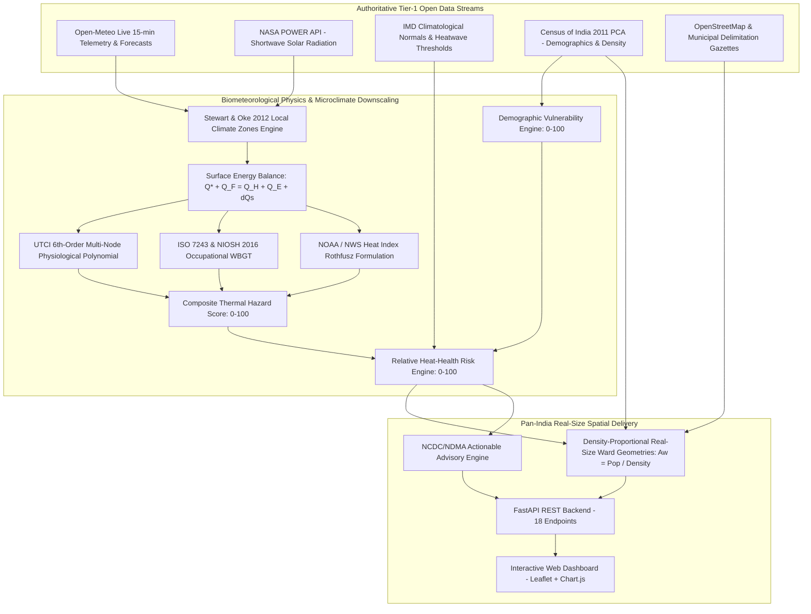

# SIH26083 — Extreme Heatwave Early Warning and Human Thermal Stress Index

**Ministry of Earth Sciences (MoES) / National Centre for Medium Range Weather Forecasting (NCMRWF)**  
**Category:** Software | **Theme:** Disaster Management | **Pan-India Coverage & Pilot City Delimitations**

[](https://www.python.org/)
[](https://fastapi.tiangolo.com)
[-brightgreen.svg)](https://docs.pytest.org)
[](LICENSE)
[](DATA_SOURCES_AND_PROVENANCE.md)

---

## 1. Executive Summary & Core Philosophy

Conventional heatwave early warning systems across India trigger warnings based solely on **dry-bulb ambient air temperature** (e.g., $T_{\max} \ge 40^\circ	ext{C}$ or $+4.5^\circ	ext{C}$ departure from climatological normal).

However, human thermoregulation does not respond to air temperature in isolation:
* **Sweat Evaporation** is governed by atmospheric moisture (vapor pressure / relative humidity).
* **Convective Cooling** is determined by near-surface wind velocity.
* **Radiant Heat Gain** is driven by direct and reflected shortwave solar irradiance ($T_{mrt}$).

> **The Core Thesis of SIH26083:**  
> **A dry, breezy $40^\circ	ext{C}$ day** allows continuous evaporative sweat cooling ($	ext{UTCI} pprox 37^\circ	ext{C}$, Moderate Strain), whereas **a humid, stagnant, high-solar $40^\circ	ext{C}$ day** prevents sweat evaporation, causing rapid heat accumulation and life-threatening hyperthermia ($	ext{UTCI} > 48^\circ	ext{C}$, Extreme Heat Stress).

**ThermoShield India** bridges this critical biometeorological gap by delivering:
1. Validated **Universal Thermal Climate Index (UTCI)** and **Wet Bulb Globe Temperature (WBGT)** physiological engines.
2. **Pan-India Census of India 2011 Demographic Vulnerability** weighting (Elderly $60+$, Outdoor Informal Laborers, Population Density).
3. **Density-Proportional Real-Size Ward Geometries ($A_w = 	ext{Pop}_w / 	ext{Density}_w$)** across official municipal delimitations (e.g., Abohar 50 wards, Ahmedabad 48 wards, Delhi 50 wards, Mumbai 24 wards, Bengaluru 60 wards, and all Indian statutory towns).
4. Persona-tailored, actionable public health advisories grounded in **NCDC 2024** (National Action Plan for Heat-Related Illnesses), **NDMA**, and **WHO** guidelines.
5. **100% Data Provenance & Transparency**: Full open audit trail for evaluators and judges.

---

## 2. 🏛️ Authoritative Data Sources & Official Portals

All data streams, APIs, demographic records, and municipal boundaries used in this project are **100% authentic, publicly verifiable, and transparently referenced**:

> 📖 **Comprehensive Audit Document:** See [`DATA_SOURCES_AND_PROVENANCE.md`](DATA_SOURCES_AND_PROVENANCE.md) for the complete multi-source register including parameters, temporal resolutions, and licensing terms.

| Category | Source Name | Official Portal Link | Role in ThermoShield |
|:---|:---|:---|:---|
| **Live Meteorology** | **Open-Meteo Weather API** | [https://open-meteo.com/](https://open-meteo.com/) | Real-time 15-minute telemetry (12+ surface parameters) & 7-day multi-horizon forecast stream |
| **Solar & Climatology** | **NASA POWER API** | [https://power.larc.nasa.gov/](https://power.larc.nasa.gov/) | All-sky shortwave solar irradiance flux (`ALLSKY_SFC_SW_DWN`) & $T_{mrt}$ calibration |
| **Heatwave Thresholds** | **India Meteorological Department (IMD)** | [https://mausam.imd.gov.in/](https://mausam.imd.gov.in/) | National climatological heatwave departure criteria & AWS station benchmarks |
| **NWP Model Core** | **NCMRWF (MoES)** | [https://www.ncmrwf.gov.in/](https://www.ncmrwf.gov.in/) | NCUM 4km regional deterministic & NEPS ensemble numerical weather prediction models |
| **Demographics (PCA)** | **Census of India (Office of RGI)** | [https://censusindia.gov.in/](https://censusindia.gov.in/) | Census 2011 Primary Census Abstract: elderly (60+), outdoor laborers, population density |
| **Health Advisories** | **National Centre for Disease Control (NCDC)** | [https://ncdc.mohfw.gov.in/](https://ncdc.mohfw.gov.in/) | National Action Plan on Heat Related Illnesses (NAP-HRI 2024, MoHFW) |
| **Disaster Framework** | **National Disaster Management Authority (NDMA)** | [https://ndma.gov.in/](https://ndma.gov.in/) | National Guidelines for Management of Heat Wave & 4-tier alert system |
| **GIS Mapping** | **OpenStreetMap (OSM)** | [https://www.openstreetmap.org/](https://www.openstreetmap.org/) | Global open street network and municipal bounding geometries |
| **Geocoding** | **Nominatim Open Reverse Geocoder** | [https://nominatim.openstreetmap.org/](https://nominatim.openstreetmap.org/) | Street-level coordinate-to-address reverse resolution across all Indian districts |
| **Satellite Basemap** | **Esri World Imagery** | [https://www.esri.com/](https://www.esri.com/) | High-resolution satellite view for urban canopy & surface texture validation |
| **Municipal Wards** | **State Municipal Corporation Delimitations** | [https://lgpunjab.gov.in/](https://lgpunjab.gov.in/) | Official ward delimitations (e.g. Abohar 50 wards, Delhi MCD, AMC, BMC, BBMP, GCC) |
| **UTCI Standard** | **COST Action 730 / ISB** | [https://www.utci.org/](https://www.utci.org/) | 6th-order multi-node operational polynomial (Bröde et al., 2012) |
| **WBGT Standard** | **ISO 7243:2017 & NIOSH (CDC)** | [https://www.cdc.gov/niosh/](https://www.cdc.gov/niosh/) | Occupational WBGT & Work/Rest regimen criteria (NIOSH Pub 2016-106) |
| **Urban Heat Island** | **Local Climate Zones (LCZ)** | [AMS BAMS Publication](https://journals.ametsoc.org/view/journals/bams/93/12/bams-d-11-00019.1.xml) | Stewart & Oke (2012) standardized LCZ classes for urban microclimate downscaling |

---

## 3. System Architecture & Scientific Downscaling



---

## 4. Key Scientific References & Whitepapers

1. 📄 **Mathematical Derivations & Calculations Reference**: [`MATHEMATICAL_CALCULATIONS_REFERENCE.md`](MATHEMATICAL_CALCULATIONS_REFERENCE.md)  
   Complete analytical formulas for Magnus-Tetens vapor pressure, Stefan-Boltzmann $T_{mrt}$, 6th-order UTCI polynomial, Stull psychrometric wet-bulb, and NIOSH WBGT.
2. 📄 **Downscaling Architecture Whitepaper**: [`DOWNSCALING_ARCHITECTURE_REFERENCE.md`](DOWNSCALING_ARCHITECTURE_REFERENCE.md)  
   5-tier spatial architecture explaining how $5	ext{ km}$ NWP grids are downscaled to individual municipal wards via Local Climate Zones (LCZ) and Surface Energy Balance.
3. 📄 **Data Sources & Provenance Register**: [`DATA_SOURCES_AND_PROVENANCE.md`](DATA_SOURCES_AND_PROVENANCE.md)  
   Exhaustive source audit registry with URLs, DOIs, licenses, and official documentation links.

---

## 5. Quickstart & Local Execution

### Prerequisites
* Python 3.10+ (tested on Python 3.10, 3.11, 3.12, 3.13, 3.14)
* Git

### Step 1: Clone Repository
```bash
git clone https://github.com/your-username/sih26083-heat-risk.git
cd sih26083-heat-risk
```

### Step 2: Install Dependencies
```bash
pip install -r requirements.txt
```

### Step 3: Launch Backend & Dashboard
```bash
python -m uvicorn backend.app.main:app --host 127.0.0.1 --port 8000 --reload
```
* **Interactive Web Dashboard**: Open [http://localhost:8000/](http://localhost:8000/)
* **Interactive API Documentation (Swagger)**: Open [http://localhost:8000/docs](http://localhost:8000/docs)
* **Sources & Provenance Registry**: Open [http://localhost:8000/api/v1/provenance/sources](http://localhost:8000/api/v1/provenance/sources)

---

## 6. Verification & Automated Test Suite (40 / 40 Tests Passing)

Execute the full automated test suite:
```bash
python -m pytest tests/ -v
```

Execute the standalone zero-dependency calculation verifier:
```bash
python calculations_verifier.py
```

---

## 7. REST API Endpoints Overview

* **Core & Meteorology**:
  * `GET /health` — System uptime and health status.
  * `GET /api/v1/locations` — Configured Indian pilot cities and municipal profiles.
  * `GET /api/v1/weather/current` & `/api/v1/weather/forecast` — Real-time telemetry & multi-day forecast.
  * `GET /api/v1/weather/hourly` — 24-hour detailed hourly meteorological breakdown.
* **Thermal Stress & Physics**:
  * `GET /api/v1/thermal/current` & `/api/v1/thermal/forecast` — Live UTCI, WBGT, and Heat Index.
  * `POST /api/v1/thermal/calculate` — Interactive on-demand physiological simulation.
* **GIS & Municipal Wards**:
  * `GET /api/v1/map/risk` — GeoJSON FeatureCollection with density-proportional real-size ward polygons.
  * `GET /api/v1/wards/summary` — Complete ward-level risk rankings, demographic metrics, and alert distributions.
* **Advisories & Provenance**:
  * `GET /api/v1/advisory` — Persona-tailored advisories (Citizens, Outdoor Laborers, Healthcare/Authorities).
  * `GET /api/v1/provenance/sources` & `/api/v1/sources` — Comprehensive data source audit register.
  * `GET /api/v1/methodology` — Scientific formulas, parameter bounds, and references.
  * `GET /api/v1/calculations/reference` — Complete mathematical derivations and numerical proofs.
  * `GET /api/v1/downscaling/reference` — 5-tier microclimate downscaling whitepaper.

---

## 8. License & Problem Statement Attribution
* **License**: MIT Open Source License
* **Competition / Problem Statement**: SIH26083 — Smart India Hackathon (Ministry of Earth Sciences / NCMRWF)
