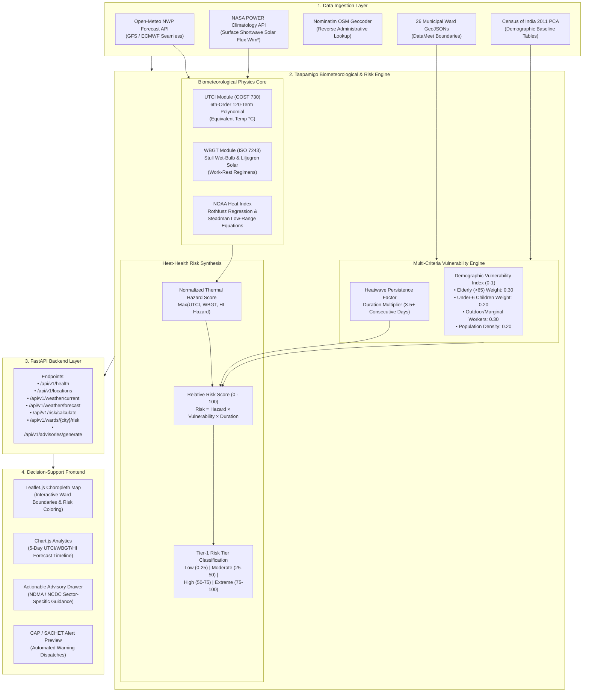

# Taapamigo — Extreme Heatwave Early Warning & Human Thermal Stress Index

[](https://www.sih.gov.in/)
[](https://www.ncmrwf.gov.in/)
[](https://www.python.org/)
[](https://fastapi.tiangolo.com/)
[](LICENSE)
[](tests/)
[](https://vercel.com/)

**Taapamigo** is an open, scientifically rigorous, and reproducible early warning and human thermal stress decision-support system engineered for Indian municipal corporations and disaster management authorities. It translates numerical weather prediction feeds into localized public health actions by quantifying **"what the weather will do to human physiology"** at the municipal ward level.

---

## Current Status: Tier 1 Working Prototype

```
CURRENT STATUS:
TIER 1 — WORKING PROTOTYPE (DELIVERED & FULLY VERIFIED SCOPE)
```

> **Tier 1 Delivered Scope:** A functional, zero-configuration software system demonstrating the complete biometeorological decision-support workflow: ingesting live public meteorological telemetry, calculating peer-reviewed human physiological indices (UTCI COST 730, ISO 7243 WBGT, NOAA Heat Index), weighting multi-criteria demographic vulnerabilities (Census of India 2011 PCA), prioritizing 27 Indian urban centers on interactive GIS choropleth maps, and generating actionable, persona-specific NDMA/NCDC-grounded health advisories.

---

## 1. The Core Problem

Extreme heatwaves pose an escalating public health crisis across India, claiming lives and crippling urban productivity. Existing meteorological warning workflows suffer from three fundamental limitations:

1. **Reliance on Dry-Bulb Air Temperature ($T_a$) Alone:**  
   Standard weather forecasts report shade air temperature, ignoring humidity, wind speed, and solar irradiance. A humid $37^\circ\text{C}$ with $75\%$ relative humidity in coastal Mumbai or Chennai imposes greater cardiovascular and thermoregulatory strain than a dry $43^\circ\text{C}$ in Rajasthan because evaporative sweat cooling is suppressed.
2. **Homogeneous City-Wide Warnings:**  
   Conventional warnings treat entire metropolitan districts as uniform blocks (e.g., *"Heatwave Alert for Delhi"*). In reality, thermal stress and mortality vulnerability vary drastically between dense informal settlements, tree-lined residential zones, and industrial corridors.
3. **Lack of Actionable, Persona-Specific Guidance:**  
   Generic advisories (*"stay indoors"*) are unfeasible for daily-wage outdoor laborers, street vendors, and municipal sanitation workers. Municipal authorities require ward-level prioritization to dispatch emergency water tankers, adjust outdoor labor regimens, and alert primary health centers.

---

## 2. The Taapamigo Solution

Taapamigo bridges the gap between atmospheric numerical models and localized municipal public health interventions through an interpretable, physically grounded 6-stage pipeline:

* **Biometeorological Physics Core:** Computes physiological equivalent temperature via Universal Thermal Climate Index (UTCI), occupational Wet Bulb Globe Temperature (WBGT), and the NOAA Heat Index.
* **Demographic Vulnerability Weighting:** Incorporates Census of India 2011 Primary Census Abstract (PCA) indicators (elderly population, outdoor/marginal workers, and population density).
* **High-Resolution GIS Ward Delimitation:** 26 official DataMeet municipal corporation vector boundaries plus official Abohar gazette delimitation (over 1,100 surveyed municipal wards).
* **Multi-Horizon Decision Support:** 5-day risk trajectories, diurnal 24-hour heat timelines, and sector-specific advisories aligned with the National Action Plan on Heat Related Illnesses (NCDC NAP-HRI 2024) and NDMA Heat Wave Guidelines.

---

## 3. Technical Architecture Flowchart



---

## 4. Confirmed Tier-1 Capabilities

| Capability | Implementation Detail | Reference / Source |
|---|---|---|
| **Live Surface Meteorology** | Real-time dry-bulb temperature ($T_a$), relative humidity ($RH$), dew point ($T_{dp}$), 10m wind speed, surface pressure, and UV index. | Open-Meteo Global NWP API |
| **Solar Radiation Flux** | All-sky surface downward solar irradiance ($W/m^2$) converted to Mean Radiant Temperature ($T_{mrt}$). | NASA POWER / ISO 7726:1998 |
| **Universal Thermal Climate Index** | Multi-node thermoregulation model using the validated 120-term 6th-order polynomial approximation. | Bröde et al. (2012), COST 730 |
| **Wet Bulb Globe Temperature** | Stull (2011) psychrometric wet-bulb + Liljegren black globe radiative equilibrium for outdoor/shade work-rest regimens. | ISO 7243:2017 / NIOSH 2016 |
| **NOAA / NWS Heat Index** | 9-parameter Rothfusz regression with Steadman low-range boundary conditions. | Rothfusz (1990), NWS SR 90-23 |
| **Demographic Vulnerability** | Standardized multi-criteria weighting across 46 Indian districts (Elderly, Outdoor Workers, Population Density). | Census of India 2011 PCA |
| **Heatwave Persistence** | Multi-day cumulative duration multiplier triggering alert escalation for consecutive extreme days. | IMD Heatwave Bulletins |
| **Municipal GIS Choropleth** | Interactive Leaflet GIS choropleth displaying surveyed ward boundaries across 27 urban centers. | DataMeet & Official State Gazettes |
| **Decision-Support Side Drawer** | Location-specific analytical breakdown explaining *why* a ward is at risk (thermal hazard vs. demographic vulnerability). | Taapamigo Risk Engine |
| **Actionable Advisories** | Tailored recommendations for Citizens, Outdoor Workers, Municipal Authorities, and Healthcare Departments. | NCDC NAP-HRI 2024 / NDMA HAP |
| **Emergency Alerts (CAP v1.2)** | ITU-T X.1303 / OASIS Common Alerting Protocol XML/JSON alert payloads and citizen SMS broadcast text. | NDMA SACHET Standards |
| **Zero-Configuration Deployment** | Standalone SQLite bootstrap with automated seeding; production-ready for Vercel Serverless and Docker. | ASGI / Vercel Python Runtime |

---

## 5. Supported Municipal Corporations & GIS Coverage

Taapamigo includes surveyed vector ward geometries for **27 Indian urban centers** covering over 1,100 municipal wards:

* **Northern Region:** Delhi (250 Wards / 12 Zones), Lucknow (110 Wards), Kanpur, Varanasi, Agra, Prayagraj, Meerut, Bareilly, Aligarh, Moradabad, Abohar (50 Wards, Official Gazette).
* **Western Region:** Mumbai (24 Administrative Wards), Ahmedabad (48 Wards / 7 Zones), Pune, Surat, Jaipur, Nagpur, Nashik.
* **Southern Region:** Bengaluru (198/243 Wards), Chennai (200 Wards / 15 Zones), Hyderabad (150 Wards / 30 Circles), Thiruvananthapuram, Kochi (Ernakulam), Kozhikode.
* **Eastern & Central Region:** Kolkata (144 Wards / 16 Boroughs), Patna, Bhopal.

*(For any non-surveyed Indian coordinate or town, the platform utilizes dynamic Stewart & Oke 2012 Local Climate Zone spatial disaggregation to deliver continuous coverage).*

---

## 6. Technology Stack

* **Backend Framework:** Python 3.10+ with [FastAPI](https://fastapi.tiangolo.com/) (ASGI, OpenAPI 3.1, Pydantic v2 validation).
* **Database & Persistence:** SQLAlchemy 2.0 ORM supporting SQLite (zero-config local run) and PostgreSQL/PostGIS (high-throughput production).
* **Frontend Presentation:** Standards-compliant Vanilla HTML5 / ES6 JavaScript / CSS3 design system (zero external framework bloat).
* **Geospatial & Analytics:** Leaflet.js 1.9.4, Chart.js 4.4.1, GeoJSON vector handling, OpenStreetMap tiles.
* **Deployment Support:** Vercel Edge CDN & Serverless Python Runtime, Docker, Docker Compose, Linux systemd.

---

## 7. Project Directory Structure

```
sih-heat-risk/
├── api/
│   └── index.py                     # Vercel serverless ASGI entrypoint
├── backend/
│   └── app/
│       ├── api/                     # REST API endpoints (health, cities, weather, risk, wards)
│       ├── core/                    # App configuration, logging, and environment settings
│       ├── data_sources/            # Weather ingestion (Open-Meteo, NASA POWER, Nominatim)
│       ├── gis/                     # Spatial ward directory, bounding boxes, and GeoJSON loader
│       ├── models/                  # SQLAlchemy ORM and Pydantic schemas
│       ├── risk/                    # Biometeorology (UTCI, WBGT, HI), vulnerability, persistence
│       └── main.py                  # FastAPI application factory
├── config/                          # Declarative YAML configs (thresholds, city profiles, weights)
├── data/
│   ├── datameet_wards/              # 26 official municipal corporation GeoJSON vector boundary files
│   ├── sample/                      # Census 2011 PCA demographic baseline datasets
│   ├── data_dictionary.md           # Database entities and data schema reference
│   └── SOURCE_REGISTRY.md           # Authoritative data sources and provenance registry
├── docs/                            # In-depth technical architecture, methodology, and API docs
│   ├── science/                     # Mathematical derivations for UTCI, WBGT, and Heat Index
│   ├── API_REFERENCE.md             # Complete REST API specification
│   ├── ARCHITECTURE.md              # Detailed system architecture document
│   ├── LIMITATIONS.md               # Honest scientific boundaries and assumptions
│   ├── ROADMAP.md                   # Multi-tier development roadmap
│   └── VERCEL_DEPLOYMENT.md         # Vercel serverless deployment guide
├── frontend/                        # Production UI (HTML, CSS, JavaScript, vendor assets)
├── public/                          # Static assets mirror served directly by Vercel Edge CDN
├── scripts/                         # Local development runners and dataset build utilities
├── tests/                           # 51 passing automated pytest test cases
├── .env.example                     # Environment configuration template
├── requirements.txt                 # Python dependencies
├── run_local.py                     # Zero-configuration local development server
└── vercel.json                      # Vercel deployment and routing rules
```

---

## 8. Local Setup & Quickstart

### Prerequisites
* Python 3.10, 3.11, 3.12, 3.13, or 3.14
* Git and pip

### Installation Steps

1. **Clone the Repository:**
   ```bash
   git clone https://github.com/Lovish-creator/sih-heat-risk.git
   cd sih-heat-risk
   ```

2. **Create and Activate a Virtual Environment:**
   ```bash
   # Windows (PowerShell)
   python -m venv venv
   .\venv\Scripts\Activate.ps1

   # Linux / macOS
   python3 -m venv venv
   source venv/bin/activate
   ```

3. **Install Dependencies:**
   ```bash
   pip install -r requirements.txt
   ```

4. **Launch the Evaluation Server:**
   ```bash
   # Option A: One-click Python runner (auto-initializes database)
   python run_local.py

   # Option B: Windows batch file
   .\scripts\run_local.bat

   # Option C: Direct Uvicorn command
   python -m uvicorn backend.app.main:app --host 127.0.0.1 --port 8000 --reload
   ```

5. **Access the Application:**
   * **Web Dashboard:** [http://127.0.0.1:8000/](http://127.0.0.1:8000/)
   * **Interactive Swagger API Docs:** [http://127.0.0.1:8000/docs](http://127.0.0.1:8000/docs)
   * **ReDoc Technical Reference:** [http://127.0.0.1:8000/redoc](http://127.0.0.1:8000/redoc)

---

## 9. REST API Overview

Taapamigo provides 18 operational REST API endpoints:

| Endpoint | Method | Description |
|---|---|---|
| `/api/v1/health` | `GET` | System health check, database status, and version. |
| `/api/v1/locations` | `GET` | List of all 27 supported municipal corporations and ward counts. |
| `/api/v1/weather/current` | `GET` | Current surface weather telemetry by coordinates or city. |
| `/api/v1/weather/forecast` | `GET` | 5-day hourly and daily meteorological forecast. |
| `/api/v1/risk/calculate` | `POST` | Calculates UTCI, WBGT, Heat Index, and Relative Risk for custom inputs. |
| `/api/v1/wards/{city}/risk` | `GET` | Ward-level risk scores, demographic vulnerability, and GeoJSON choropleth. |
| `/api/v1/advisories/generate` | `POST` | Sector-specific NDMA/NCDC advisories for 4 target personas. |
| `/api/v1/alerts/cap` | `POST` | Formats ITU/WMO CAP v1.2 XML/JSON emergency alert payloads. |

### Example API Request
```bash
curl -X GET "http://127.0.0.1:8000/api/v1/health"
```
```json
{
  "status": "healthy",
  "app_name": "SIH26083-Taapamigo-India",
  "version": "2.0.0-modular",
  "demo_mode": true,
  "timestamp": "2026-09-16T01:55:00Z",
  "database_status": "ONLINE"
}
```

---

## 10. Peer-Reviewed Scientific Foundations

1. **Universal Thermal Climate Index (UTCI):**  
   Bröde, P., et al. (2012). *Deriving the operational procedure for the Universal Thermal Climate Index (UTCI)*. International Journal of Biometeorology, 56(3), 481-494. [doi:10.1007/s00484-011-0454-1](https://doi.org/10.1007/s00484-011-0454-1).
2. **Wet Bulb Globe Temperature (WBGT):**  
   ISO 7243:2017. *Ergonomics of the thermal environment — Assessment of heat stress using the WBGT index*. International Organization for Standardization, Geneva.
3. **Psychrometric Wet-Bulb Derivation:**  
   Stull, R. (2011). *Wet-Bulb Temperature from Relative Humidity and Air Temperature*. Journal of Applied Meteorology and Climatology, 50(11), 2267-2269. [doi:10.1175/JAMC-D-11-0143.1](https://doi.org/10.1175/JAMC-D-11-0143.1).
4. **NOAA / NWS Heat Index:**  
   Rothfusz, L. P. (1990). *The Heat Index Equation*. National Weather Service Technical Attachment SR 90-23, Fort Worth, Texas.
5. **Local Climate Zones (LCZ):**  
   Stewart, I. D., & Oke, T. R. (2012). *Local Climate Zones for Urban Temperature Studies*. Bulletin of the American Meteorological Society, 93(12), 1879-1900.
6. **National Heat Health Guidelines:**  
   National Centre for Disease Control (NCDC, MoHFW, 2024). *National Action Plan on Heat Related Illnesses (NAP-HRI)*. Directorate General of Health Services, New Delhi.

---

## 11. Scientific Boundaries & Ethical Commitments

To maintain complete scientific integrity, Taapamigo strictly adheres to the following principles:

* **No Synthetic Clinical Claims:** The Relative Risk Score ($0–100$) represents relative environmental exposure and demographic sensitivity to guide municipal emergency resource allocation. It is **not** a clinical prediction of mortality counts or hospital admissions.
* **No Black-Box ML Disguised as Science:** The core Tier 1 engine uses validated deterministic biometeorological physics equations, not synthetic machine-learning models trained without verified health labels.
* **Transparent Data Sources:** Every data variable is explicitly mapped to its origin (Open-Meteo, NASA POWER, Census 2011 PCA, DataMeet GIS) with documented latency, accuracy, and resolution.

---

## 12. Strategic Multi-Tier Roadmap

```
┌─────────────────────────────────────────────────────────────┐
│ TIER 1: Current Working Prototype (Delivered & Verified)    │
│ • Open-Meteo & NASA POWER telemetry ingestion               │
│ • UTCI, WBGT, Heat Index deterministic physics              │
│ • Census 2011 PCA demographic multi-criteria weighting      │
│ • 27 municipal corporations with official GIS boundaries    │
│ • Interactive Leaflet choropleth & decision-support drawer  │
└──────────────────────────────┬──────────────────────────────┘
                               │
                               ▼
┌─────────────────────────────────────────────────────────────┐
│ TIER 2: Data-Connected Pilot (Planned Institutional Scope)   │
│ • Formal MoES / NCMRWF NCUM 4km NWP model feed ingestion   │
│ • IMD Automatic Weather Station (AWS) network integration   │
│ • PostGIS spatial database with automated Celery ingestion  │
│ • De-identified IHIP / municipal hospital heatstroke data   │
│ • Distributed Lag Non-linear Model (DLNM) risk calibration  │
└──────────────────────────────┬──────────────────────────────┘
                               │
                               ▼
┌─────────────────────────────────────────────────────────────┐
│ TIER 3: National Production System (Long-Term Vision)       │
│ • Pan-India coverage across all 4,000+ Urban Local Bodies   │
│ • INSAT-3D & Sentinel-3 Land Surface Temperature downscaling│
│ • Automated NDMA SACHET SMS / Cell Broadcast CAP gateway   │
│ • Urban canopy micro-simulation (100m building resol.)      │
│ • Deployment on NIC MeghRaj cloud infrastructure           │
└─────────────────────────────────────────────────────────────┘
```

See [`docs/ROADMAP.md`](docs/ROADMAP.md) and [`docs/TIER_STATUS.md`](docs/TIER_STATUS.md) for full architectural transition specifications.

---

## 13. Documentation Index

| Document | Description |
|---|---|
| [`docs/API_REFERENCE.md`](docs/API_REFERENCE.md) | Complete OpenAPI / REST endpoint specifications and request schemas |
| [`docs/ARCHITECTURE.md`](docs/ARCHITECTURE.md) | Architectural specifications for Tier 1 prototype and future Tier 2/3 systems |
| [`docs/METHODOLOGY.md`](docs/METHODOLOGY.md) | Complete biometeorological equations and calculation pipeline reference |
| [`docs/RISK_METHODOLOGY.md`](docs/RISK_METHODOLOGY.md) | IPCC SREX / AR6 disaster risk framework mathematical formulation |
| [`docs/DATA_SOURCES.md`](docs/DATA_SOURCES.md) | Authoritative registry of all data sources, resolutions, and access tiers |
| [`docs/LIMITATIONS.md`](docs/LIMITATIONS.md) | Transparent scientific limitations and technical boundaries |
| [`docs/ROADMAP.md`](docs/ROADMAP.md) | 3-tier technical roadmap from prototype to national deployment |
| [`docs/TIER_STATUS.md`](docs/TIER_STATUS.md) | Detailed capability matrix comparing Tier 1 vs Tier 2 vs Tier 3 |
| [`docs/FEATURES.md`](docs/FEATURES.md) | Feature matrix for municipal officers and disaster managers |
| [`docs/HEALTH_DATA_READINESS.md`](docs/HEALTH_DATA_READINESS.md) | Ethical guidelines and technical schema for future clinical health data |
| [`docs/MODEL_CARD.md`](docs/MODEL_CARD.md) | Model card following Mitchell et al. (2019) standards |
| [`docs/VERCEL_DEPLOYMENT.md`](docs/VERCEL_DEPLOYMENT.md) | Step-by-step deployment guide for Vercel serverless platform |
| [`docs/science/utci.md`](docs/science/utci.md) | Fiala multi-node / Bröde 6th-order polynomial mathematical specification |
| [`docs/science/wbgt.md`](docs/science/wbgt.md) | Liljegren / ISO 7243 WBGT formulation and NIOSH work-rest cycles |
| [`docs/science/heat-index.md`](docs/science/heat-index.md) | Rothfusz 9-parameter regression derivation and Steadman boundaries |
| [`data/SOURCE_REGISTRY.md`](data/SOURCE_REGISTRY.md) | Machine-readable source catalog and update frequency |
| [`data/data_dictionary.md`](data/data_dictionary.md) | Complete database entity-relationship schema and field definitions |

---

## 14. Verification & Automated Tests

Taapamigo includes a comprehensive automated test suite covering meteorological calculations, biometeorological indices, demographic vulnerability algorithms, GIS boundaries, and REST API contracts:

```bash
# Run pytest test suite
python -m pytest -v
```

```
============================== 51 passed in 4.64s ==============================
```

All 51 tests execute deterministically offline using bundled mock data fixtures with zero network dependency.

---

## License

This project is licensed under the **MIT License** — see the [`LICENSE`](LICENSE) file for details.
