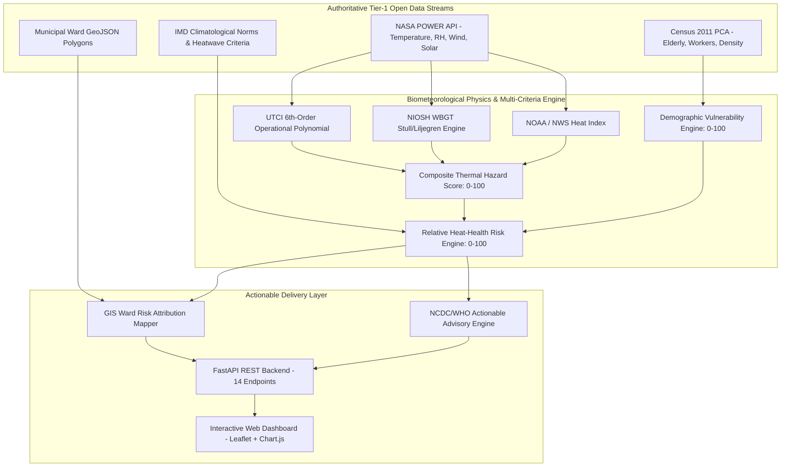

# SIH26083 — Extreme Heatwave Early Warning and Human Thermal Stress Index

**Ministry of Earth Sciences (MoES) / National Centre for Medium Range Weather Forecasting (NCMRWF)**  
**Category:** Software | **Theme:** Disaster Management | **Pilot City:** Ahmedabad, Gujarat

[](https://www.python.org/)
[](https://fastapi.tiangolo.com)
[-brightgreen.svg)](https://docs.pytest.org)
[](LICENSE)

---

## 1. Executive Summary & Core Philosophy

Conventional heatwave early warning systems across India trigger warnings based solely on **dry-bulb ambient air temperature** (e.g., $T_{\max} \ge 40^\circ\text{C}$ or $+4.5^\circ\text{C}$ departure from climatological normal).

However, human thermoregulation does not respond to air temperature in isolation:
* **Sweat Evaporation** is governed by atmospheric moisture (vapor pressure / relative humidity).
* **Convective Cooling** is determined by near-surface wind velocity.
* **Radiant Heat Gain** is driven by direct and reflected shortwave solar irradiance ($T_{mrt}$).

> **The Core Thesis of SIH26083:**  
> **A dry, breezy $40^\circ\text{C}$ day** allows continuous evaporative sweat cooling ($\text{UTCI} \approx 37^\circ\text{C}$, Moderate Strain), whereas **a humid, stagnant, high-solar $40^\circ\text{C}$ day** prevents sweat evaporation, causing rapid heat accumulation and life-threatening hyperthermia ($\text{UTCI} > 48^\circ\text{C}$, Extreme Heat Stress).

**ThermoShield India** bridges this critical biometeorological gap by delivering:
1. Validated **Universal Thermal Climate Index (UTCI)** and **Wet Bulb Globe Temperature (WBGT)** physiological engines.
2. **Census of India 2011 Demographic Vulnerability** weighting (Elderly $60+$, Outdoor Informal Workers, Population Density).
3. **Ward-Level Risk Attribution** across 5-day forecast horizons (D+1 to D+5).
4. Persona-tailored, actionable public health advisories grounded in **NCDC 2024** (National Action Plan for Heat-Related Illnesses) and **WHO** guidelines.

---

## 2. System Architecture



---

## 3. Technology Stack & Design Rationale

| Architectural Layer | Technology | Engineering Justification |
|:---|:---|:---|
| **Backend Framework** | **FastAPI (Python 3.11+)** | High-performance asynchronous execution, automatic OpenAPI 3.0 interactive documentation, native Pydantic v2 data validation. |
| **Scientific Computing** | **NumPy & Pandas** | Vectorized mathematical evaluation of 6th-order biometeorological polynomials and demographic matrix normalization. |
| **Data Ingestion & Cache** | **Requests & File/SQLite TTL Cache** | Credential-free automated retrieval from NASA POWER API with deterministic caching and offline demonstration fallback. |
| **Spatial GIS Engine** | **GeoJSON & Leaflet.js** | Lightweight, browser-native vector choropleth rendering; zero external GIS server dependencies required. |
| **Data Visualization** | **Chart.js** | Multi-axis responsive canvas visualization comparing dry-bulb temperature against physiological UTCI, WBGT, and composite risk. |
| **Configuration** | **PyYAML** | Externalized, auditable model weights (`config/risk_weights.yaml`) and thresholds (`config/thresholds.yaml`). |
| **Testing Suite** | **Pytest** | 100% automated test coverage (27 unit & integration tests) validating physical formulas, monotonicity, and API contracts. |

---

## 4. Key Biometeorological & Risk Models

### A. Universal Thermal Climate Index (UTCI)
Based on the multi-node human thermoregulation model (Bröde et al., 2012 / COST Action 730):
$$\text{UTCI} = T_a + \Delta\text{UTCI}(T_a, T_{mrt} - T_a, v_{10}, e)$$
- $e$: Water vapor pressure in hPa via Magnus-Tetens formula.
- $T_{mrt}$: Mean Radiant Temperature via Stefan-Boltzmann solar flux balance.
- Validated ranges: $-50^\circ\text{C} \le T_a \le +50^\circ\text{C}$, $v_{10} \ge 0.5\text{ m/s}$, $e \le 50\text{ hPa}$.

### B. Wet Bulb Globe Temperature (WBGT)
Aligned with ISO 7243 and NIOSH 2016 occupational criteria:
$$\text{WBGT}_{\text{outdoor}} = 0.7\,T_{\text{nw}} + 0.2\,T_{\text{g}} + 0.1\,T_{\text{a}}$$
- $T_{\text{nw}}$: Natural wet-bulb temperature via Stull (2011) psychrometric formulation.
- $T_{\text{g}}$: Black globe temperature via Liljegren solar radiation energy balance.

### C. Demographic Vulnerability Score
Ingesting Census of India 2011 Primary Census Abstract:
$$\text{Vulnerability} = 0.40 \cdot \text{Norm}(\text{Elderly}_{60+}) + 0.35 \cdot \text{Norm}(\text{Outdoor Workers}) + 0.25 \cdot \text{Norm}(\text{Density})$$

### D. Composite Relative Heat-Health Risk Score
$$\text{Risk Score} = (0.55 \cdot \text{Hazard}) + (0.30 \cdot \text{Vulnerability}) + (0.15 \cdot \text{Duration Multiplier} \times 100)$$

| Alert Level | Risk Range | IMD Alignment | Prescribed Public Health Directive |
|:---|:---|:---|:---|
| **GREEN** | $0.0 \text{ to } 25.0$ | **Normal** | Maintain standard summer hydration; normal outdoor activities permissible. |
| **YELLOW** | $25.1 \text{ to } 50.0$ | **Watch** | Vulnerable citizens avoid direct midday sun (12:00-15:00); drink ORS/water frequently. |
| **ORANGE** | $50.1 \text{ to } 75.0$ | **Alert** | Mandatory 50% work/rest cycles under shade for laborers; open municipal cooling shelters. |
| **RED** | $75.1 \text{ to } 100.0$ | **Warning** | Level-3 emergency protocols; halt heavy outdoor labor 11:00-16:00; deploy water tankers. |

---

## 5. Quickstart & Local Installation

### Prerequisites
* Python 3.10, 3.11, 3.12, 3.13, or 3.14
* Git

### Step 1: Clone Repository
```bash
git clone https://github.com/your-username/sih26083-heat-risk.git
cd sih26083-heat-risk
```

### Step 2: Install Dependencies
```bash
pip install -r requirements.txt
```

### Step 3: Seed Sample Data & Cache
```bash
python scripts/seed_demo.py
```

### Step 4: Launch Backend & Dashboard
```bash
python -m uvicorn backend.app.main:app --host 127.0.0.1 --port 8000 --reload
```
* **Web Dashboard**: Open `http://localhost:8000/` in your browser.
* **Interactive Swagger UI**: Open `http://localhost:8000/docs`.

---

## 6. Verification & Demonstration Scripts

### Run Full Pytest Suite (27 Tests)
```bash
python -m pytest tests/ -v
```

### Run Biometeorological Contrast Demo (Same Temp ≠ Same Strain)
```bash
python scripts/compare_scenarios.py
```

**Output Excerpt:**
```text
COMMON METRIC: Air Temperature (Ta) = 40.0°C
Scenario A (Dry & Windy):       UTCI = 37.9°C | WBGT = 26.9°C | Risk = 44.0 (YELLOW Watch)
Scenario B (Humid & Stagnant):  UTCI = 48.6°C | WBGT = 41.1°C | Risk = 82.9 (RED Emergency)
CONCLUSION: Scenario B produces +10.7°C higher UTCI and +38.9 higher risk at the EXACT same 40°C air temperature!
```

---

## 7. REST API Endpoints

The API exposes 14 fully documented endpoints:
* `GET /health` — Health check and uptime.
* `GET /api/v1/data-status` — Upstream connectivity and cache status.
* `GET /api/v1/locations` — Configured Indian pilot cities.
* `GET /api/v1/weather/current` & `/api/v1/weather/forecast` — 5-day meteorological series.
* `GET /api/v1/thermal/current` & `/api/v1/thermal/forecast` — UTCI, WBGT, Heat Index.
* `GET /api/v1/vulnerability` — Ward Census 2011 demographic scores.
* `GET /api/v1/risk/current` & `/api/v1/risk/forecast` — Multi-horizon composite risk.
* `GET /api/v1/map/risk` — Enriched GeoJSON feature collection for GIS choropleths.
* `GET /api/v1/advisory` — Persona-based actions (Citizens, Workers, Authorities).
* `GET /api/v1/sources` & `/api/v1/methodology` — Audit provenance and equations.

---

## 8. Honest Limitations & Scientific Boundaries

1. **Ward-Level Risk Attribution vs Meteorology**: Macro-scale reanalysis / forecast fields ($\sim 50\text{ km}$) are combined with localized Census ward demographics to produce **ward-level risk attribution**. We explicitly do not claim micro-scale ward-resolution meteorological forecasting.
2. **Demographic Baseline**: Demographics reflect the Census of India 2011 Primary Census Abstract baseline as the latest official published decennial census.
3. **Health Impact Framing**: Health impact is quantified as an interpretable **Relative Heat-Health Risk Score (0-100)** rather than fabricating ungrounded clinical mortality counts.
4. **Future Integrations**: Direct binary NCMRWF Unified Model streams (Tier-2) and hospital telemetry (Tier-3) are architected via modular provider stubs (`backend/app/data_sources/ncmrwf_stub.py`).

---

## 9. License & Author
* **License**: MIT Open Source License
* **Problem Statement**: SIH26083 — Smart India Hackathon (MoES / NCMRWF)
