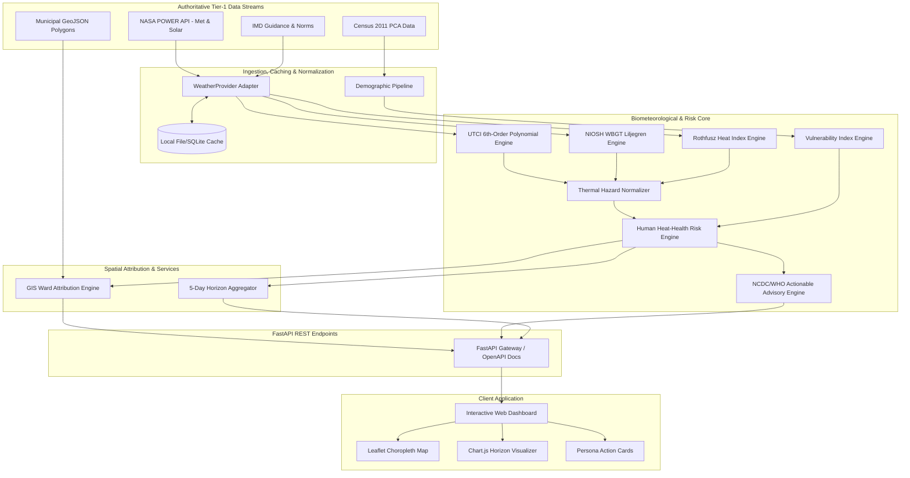
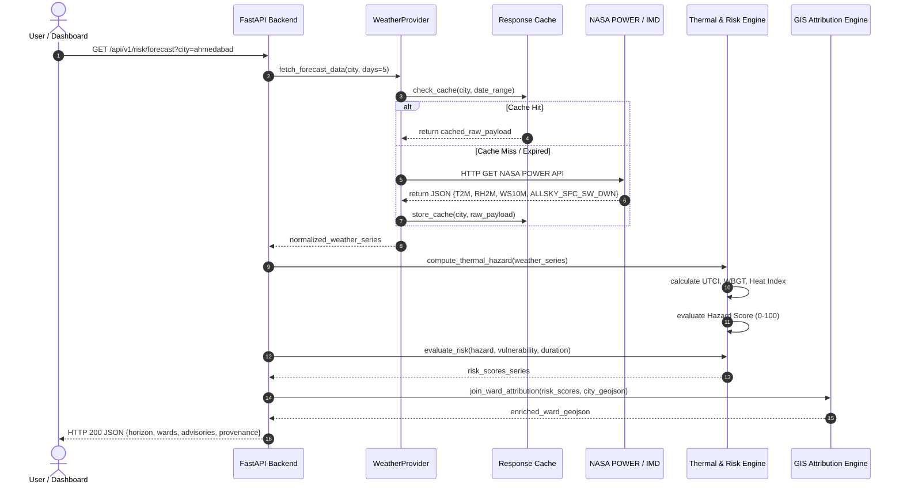
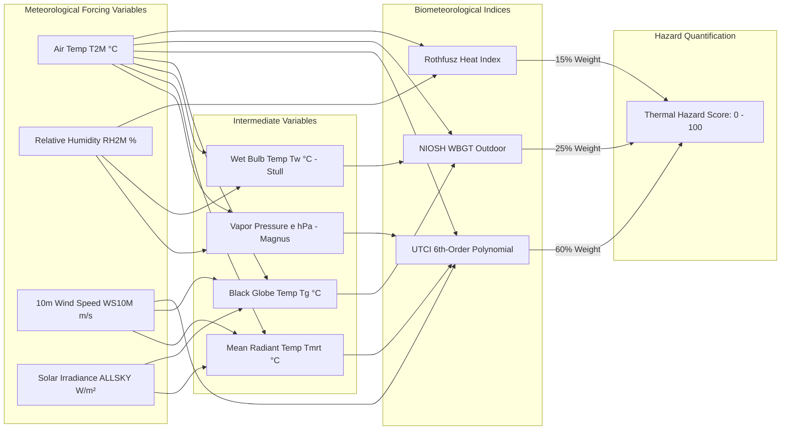
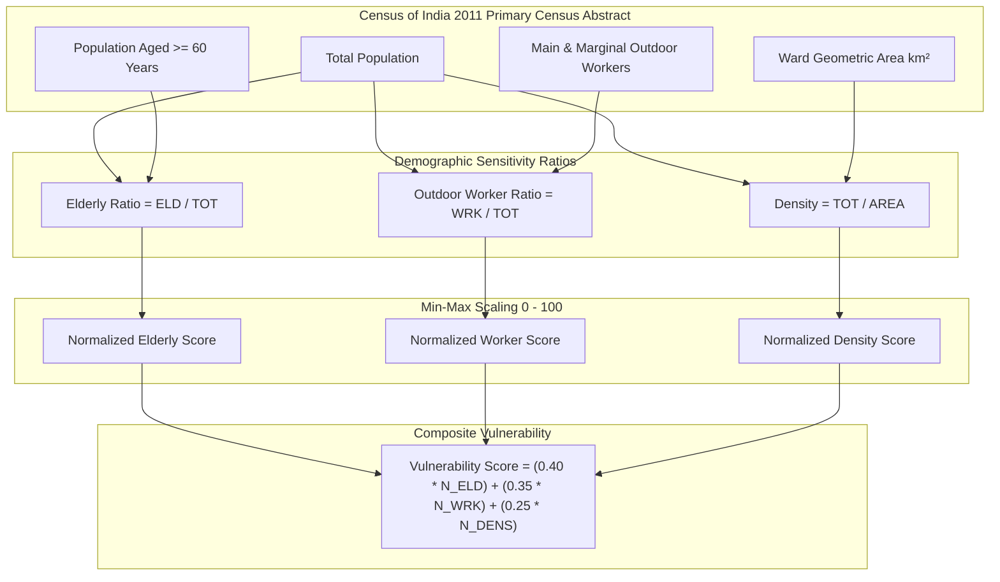
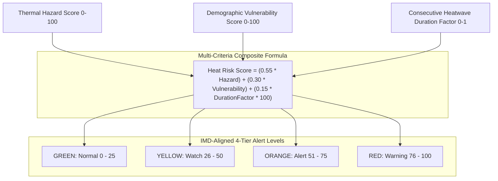
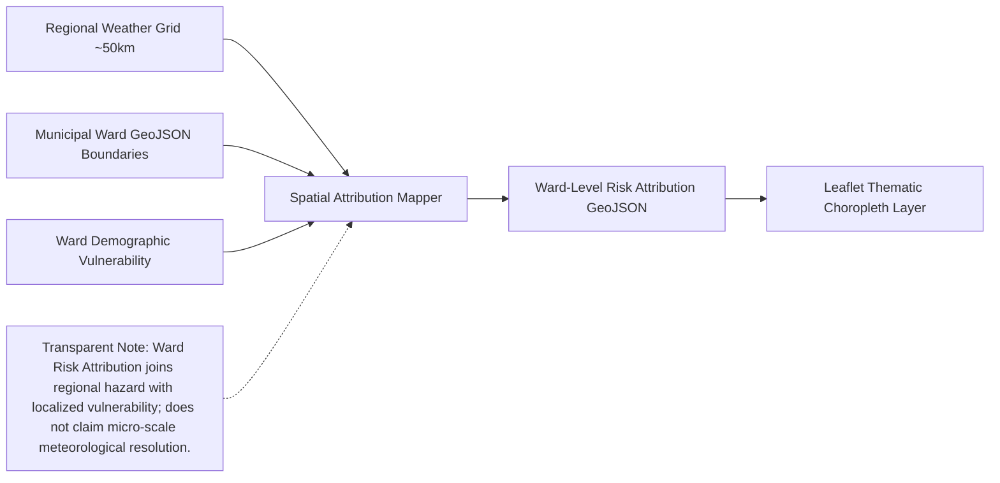
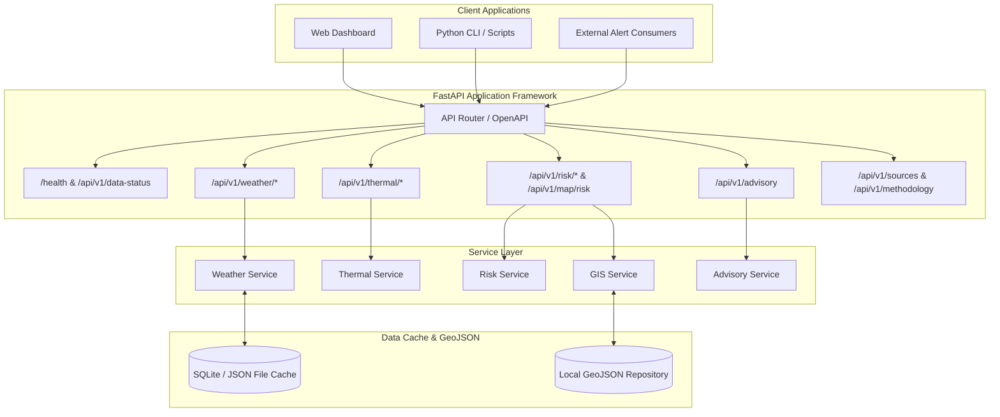
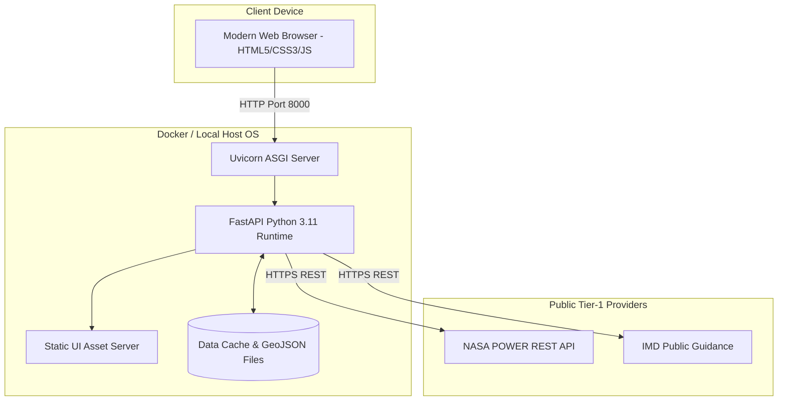
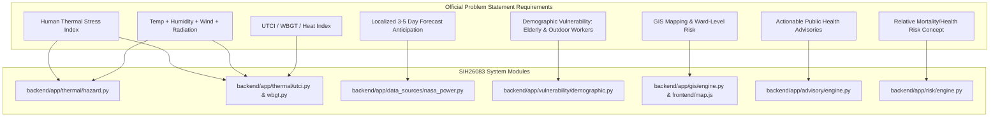

# SIH26083 - System Architecture & Technical Specification

**Extreme Heatwave Early Warning and Human Thermal Stress Index**
**Organization:** Ministry of Earth Sciences (MoES) / National Centre for Medium Range Weather Forecasting (NCMRWF)

---

## 1. Executive Summary
The SIH26083 platform transitions heatwave disaster management from monitoring simple dry-bulb atmospheric temperature to quantifying **"What the weather will do to humans"**. By coupling multi-parameter atmospheric forcing (temperature, humidity, wind velocity, and solar shortwave irradiance) with human biometeorological energy balance models (UTCI, WBGT, Heat Index) and Census demographic vulnerability, the platform generates localized **Ward-Level Relative Heat-Health Risk Scores (0–100)** and automated, persona-tailored public health advisories across a 5-day forecast horizon.

---

## 2. Problem Interpretation & Domain Boundary
Conventional heatwave alerts in India (e.g., $T_{\max} \ge 40^\circ\text{C}$ or $+4.5^\circ\text{C}$ departure from normal) suffer from two fundamental operational shortcomings:
1. **The Thermoregulatory Blindspot**: A dry, windy $40^\circ\text{C}$ day allows evaporative sweat cooling, resulting in manageable physiological stress ($\text{UTCI} \approx 35^\circ\text{C}$), whereas a humid, stagnant, high-radiation $40^\circ\text{C}$ day cripples evaporative heat dissipation, triggering lethal heat strain ($\text{UTCI} > 48^\circ\text{C}$, Extreme Heat Stress).
2. **Homogeneous Risk Assumption**: Blanket district-wide alerts ignore intra-urban demographic disparities. Wards with dense elderly populations ($60+$) and high concentrations of outdoor informal laborers face exponentially higher heat stroke morbidity than commercial zones.

SIH26083 solves both challenges through an interpretable, reproducible Tier-1 pipeline.

---

## 3. Required Architectural Diagrams

### Diagram 1 — System Architecture

---

### Diagram 2 — End-to-End Data Flow

---

### Diagram 3 — Thermal Stress Engine

---

### Diagram 4 — Vulnerability Engine

---

### Diagram 5 — Risk Engine

---

### Diagram 6 — GIS Flow

---

### Diagram 7 — API Architecture

---

### Diagram 8 — Deployment Architecture

---

### Diagram 9 — SIH Requirement Mapping

---

## 4. Functional & Non-Functional Specifications
- **Response Latency**: $< 200\text{ ms}$ for cached/GIS endpoints, $< 1.5\text{ s}$ for live NASA POWER fetches.
- **Reproducibility**: Zero proprietary API keys required. Out-of-the-box demo mode (`DEMO_MODE=true`) guarantees 100% deterministic execution during hackathon presentations.
- **Extensibility**: Clean object-oriented provider abstraction (`WeatherProvider`) allowing one-line plug-in of future NCMRWF GRIB2 or ISRO MOSDAC satellite decoders.
