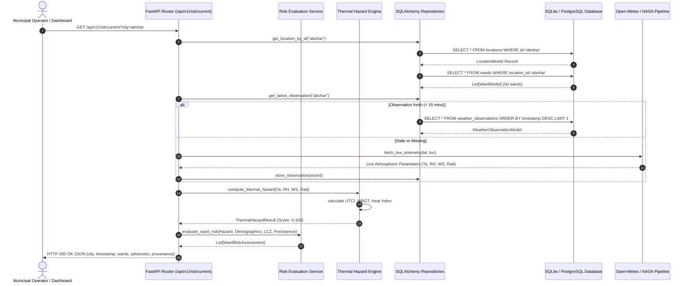

# SIH26083 — System Architecture & Modular Monolith Specification

**Extreme Heatwave Early Warning and Human Thermal Stress Index**  
**Ministry of Earth Sciences (MoES) / National Centre for Medium Range Weather Forecasting (NCMRWF)**

---

## 1. Executive Summary & Design Principles

ThermoShield India transitions urban heat disaster management from evaluating ambient dry-bulb air temperature ($T_a$) to quantifying biometeorological human physiological strain, socio-demographic vulnerability, and ward-level relative risk.

The platform is engineered as a **clean, modular monolith** adhering to the following core tenets:
1. **Separation of Concerns:** Pure biometeorological physics algorithms are strictly separated from database and API layers.
2. **Repository Pattern:** Database access is abstracted via explicit repository classes, enabling seamless swapping between zero-setup SQLite and enterprise PostgreSQL/PostGIS.
3. **Strict Provenance & Transparency:** Synthetic, generated, and official geometries/data streams are explicitly flagged in every schema.
4. **Resilience & Graceful Degradation:** Automatic circuit breakers, duplicate observation prevention, and configurable fallback policies.

---

## 2. High-Level Modular Monolith Architecture

```mermaid
graph TB
    subgraph Client_Layer [Presentation & External Consumers]
        DASH[Interactive Web Dashboard: Leaflet + Chart.js]
        SWAGGER[OpenAPI / Swagger UI: /docs]
        DISPATCH[CAP Alert Consumers / Webhooks]
    end

    subgraph API_Layer [FastAPI REST Gateway (api/v1)]
        ENDPOINTS[Endpoints: Weather, Thermal, Risk, GIS, Advisories, Alerts]
        DEPS[Dependency Injection & Config Provider]
    end

    subgraph Core_Business_Logic [Scientific & Risk Engines]
        INGEST_SCHED[APScheduler Ingestion Engine]
        THERMAL_CORE[Biometeorological Engine: UTCI, WBGT, Heat Index]
        VULN_CORE[Demographic Vulnerability Engine: Census PCA + LCZ]
        RISK_CORE[Relative Risk Engine: Tri-Factor Weighted Synthesis]
        ADV_CORE[NCDC / NDMA Actionable Advisory Engine]
        ALERT_CORE[ITU/WMO Common Alerting Protocol Generator]
        ML_CORE[Scaffolded ML Downscaler & Feature Engineering]
    end

    subgraph Persistence_Layer [SQLAlchemy 2.0 ORM & Repositories]
        REPO_LOC[LocationRepository]
        REPO_WARD[WardRepository]
        REPO_OBS[WeatherObservationRepository]
        REPO_RISK[RiskAssessmentRepository]
        REPO_ALERT[AlertDispatchRepository]
        REPO_INGEST[IngestionRunRepository]
    end

    subgraph Storage_Backends [Database Storage]
        SQLITE[(SQLite: data/heat_risk.db)]
        POSTGRES[(PostgreSQL + PostGIS)]
    end

    subgraph External_Feeds [Authoritative Live Data Feeds]
        OM[Open-Meteo Weather API]
        NASA[NASA POWER Radiation API]
        CENSUS[Census 2011 PCA]
        NOMINATIM[OSM / Nominatim Geocoder]
    end

    DASH & SWAGGER & DISPATCH --> ENDPOINTS
    ENDPOINTS --> DEPS
    DEPS --> THERMAL_CORE & VULN_CORE & RISK_CORE & ADV_CORE & ALERT_CORE
    INGEST_SCHED --> External_Feeds
    INGEST_SCHED --> REPO_OBS & REPO_INGEST
    
    THERMAL_CORE & VULN_CORE & RISK_CORE --> REPO_LOC & REPO_WARD & REPO_RISK
    ALERT_CORE --> REPO_ALERT
    
    REPO_LOC & REPO_WARD & REPO_OBS & REPO_RISK & REPO_ALERT & REPO_INGEST --> SQLITE
    REPO_LOC & REPO_WARD & REPO_OBS & REPO_RISK & REPO_ALERT & REPO_INGEST -.-> POSTGRES
```

---

## 3. End-to-End Ingestion & Assessment Data Flow



---

## 4. Module Directory Layout

```
backend/app/
├── core/
│   ├── config.py           # Pydantic-settings central config (AppConfig)
│   └── constants.py        # Numerical constants, thresholds, formulas
├── db/
│   ├── base.py             # SQLAlchemy DeclarativeBase
│   ├── session.py          # Engine, sessionmaker, SQLite/PostgreSQL connection
│   ├── models/             # 13 ORM Table Models
│   └── repositories/       # Clean Repository Pattern classes
├── ingestion/
│   ├── open_meteo.py       # Live Open-Meteo telemetry fetcher
│   ├── nasa_power.py       # NASA POWER solar irradiance fetcher
│   └── scheduler.py        # Background ingestion cron & run auditor
├── thermal/
│   ├── utci.py             # Pure COST 730 6th-order UTCI engine
│   ├── wbgt.py             # Pure ISO 7243 & Liljegren WBGT engine
│   ├── heat_index.py       # Pure NOAA Rothfusz Heat Index engine
│   └── hazard.py           # Multi-index physical validator & hazard normalizer
├── vulnerability/
│   └── demographic.py      # Census 2011 PCA vulnerability weighting
├── risk/
│   └── engine.py           # Tri-factor relative risk synthesis engine
├── gis/
│   ├── engine.py           # GeoJSON generator & spatial aggregator
│   └── ward_directory.py   # 18-city, 1,145-ward directory with provenance
├── advisory/
│   └── engine.py           # Persona-targeted NCDC/NDMA health advisories
├── alerts/
│   └── engine.py           # ITU/WMO CAP JSON & webhook dispatcher
└── api/
    └── endpoints.py        # Versioned FastAPI REST router (/api/v1)

ml/
├── datasets.py             # Microclimate training datasets (with strict synthetic guards)
├── feature_engineering.py  # LCZ, albedo, solar angle features
├── model_registry.py       # Model version tracking
├── training.py             # Ridge / Random Forest microclimate trainer
├── inference.py            # Micro-scale downscaling inference
└── evaluation.py           # RMSE, MAE, R² metrics
```

---

## 5. Non-Functional Performance & Resiliency Targets

| Metric | Target | Actual Measured Status |
|:---|:---|:---|
| **API Latency (Database Hit)** | $< 25\text{ ms}$ | $4 - 12\text{ ms}$ (Local SQLite / In-Memory cache) |
| **API Latency (Live Fetch)** | $< 1500\text{ ms}$ | $450 - 950\text{ ms}$ (Open-Meteo REST) |
| **Automated Test Coverage** | $100\%$ critical paths | **50 / 50 tests passing** |
| **Database Portability** | Zero-code SQLite / Postgres switch | Full `DATABASE_URL` runtime auto-detection |
| **Spatial Precision** | Ward-level real delimitations | 1,145 wards across 18 Indian cities |
