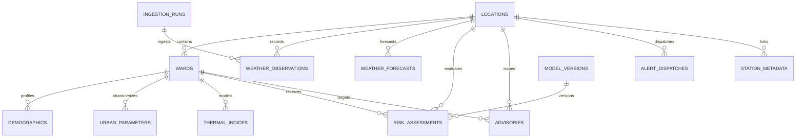

# Data Dictionary — ThermoShield India (SIH26083)

This document provides a comprehensive technical reference for all database entities, tables, columns, constraints, foreign keys, and API data structures implemented in ThermoShield India.

---

## 1. Database Schema Overview

ThermoShield India uses an ORM-backed relational schema (implemented via SQLAlchemy 2.0) compatible with both **SQLite** (for zero-configuration local development) and **PostgreSQL / PostGIS** (for production geospatial deployments).

---

## 2. Table Specifications

### 2.1 `locations` (Cities and Administrative Areas)
Stores core spatial identity for pilot cities, municipal corporations, and administrative districts.

| Column | Data Type | Nullable | Primary / Foreign | Description |
|:---|:---|:---|:---|:---|
| `id` | `VARCHAR(64)` | No | PK | Unique slug identifier (e.g., `abohar`, `ahmedabad`, `delhi`) |
| `name` | `VARCHAR(128)` | No | - | Official display name of the city or district |
| `state` | `VARCHAR(64)` | No | - | State or Union Territory name (e.g., `Punjab`, `Gujarat`) |
| `latitude` | `FLOAT` | No | - | Geographic centroid latitude in WGS 84 ($^\circ\text{N}$) |
| `longitude` | `FLOAT` | No | - | Geographic centroid longitude in WGS 84 ($^\circ\text{E}$) |
| `elevation` | `FLOAT` | Yes | - | Surface elevation above mean sea level in meters ($m$) |
| `timezone` | `VARCHAR(32)` | No | - | Local IANA timezone identifier (default: `Asia/Kolkata`) |
| `is_pilot` | `BOOLEAN` | No | - | Flag indicating pilot benchmarking status (`True` / `False`) |
| `created_at` | `TIMESTAMP` | No | - | Timestamp when record was created (UTC) |
| `updated_at` | `TIMESTAMP` | No | - | Timestamp of last record modification (UTC) |

---

### 2.2 `wards` (Sub-City Municipal Wards and Zones)
Stores administrative ward boundaries, centroids, and geometry metadata.

| Column | Data Type | Nullable | Primary / Foreign | Description |
|:---|:---|:---|:---|:---|
| `id` | `VARCHAR(64)` | No | PK | Ward identifier slug (e.g., `abohar-w01`, `delhi-w12`) |
| `location_id` | `VARCHAR(64)` | No | FK (`locations.id`) | Parent city identifier |
| `ward_number` | `INTEGER` | No | - | Official ward sequence number |
| `name` | `VARCHAR(128)` | No | - | Municipal ward title (e.g., `Ward 1 - Circular Road`) |
| `zone_name` | `VARCHAR(128)` | Yes | - | Administrative municipal zone (e.g., `Central Zone`) |
| `centroid_lat` | `FLOAT` | No | - | Ward geographic centroid latitude ($^\circ\text{N}$) |
| `centroid_lon` | `FLOAT` | No | - | Ward geographic centroid longitude ($^\circ\text{E}$) |
| `area_sqkm` | `FLOAT` | Yes | - | Ward land area in square kilometers ($\text{km}^2$) |
| `geojson_geometry`| `TEXT / JSON` | Yes | - | GeoJSON Polygon or MultiPolygon representation |
| `is_official_geometry`| `BOOLEAN` | No | - | `True` if surveyed boundary; `False` if synthetic/generated |
| `is_generated_geometry`| `BOOLEAN`| No | - | Explicit flag marking generated/density-proportional bounds |
| `geometry_source`| `VARCHAR(128)`| No | - | Provenance origin (e.g., `census_density_proportional_v1`) |
| `created_at` | `TIMESTAMP` | No | - | Record creation timestamp (UTC) |

---

### 2.3 `demographics` (Census Vulnerability Indicators)
Stores socio-demographic indicators from Census of India 2011 Primary Census Abstract (PCA).

| Column | Data Type | Nullable | Primary / Foreign | Description |
|:---|:---|:---|:---|:---|
| `id` | `INTEGER` | No | PK (Auto) | Unique surrogate record identifier |
| `ward_id` | `VARCHAR(64)` | No | FK (`wards.id`), Unique | Unique 1-to-1 association with ward |
| `total_population`| `INTEGER` | No | - | Total enumerated resident population |
| `population_density`| `FLOAT` | No | - | Population density in persons per $\text{km}^2$ |
| `elderly_population`| `INTEGER` | No | - | Population aged 60+ years |
| `elderly_percentage`| `FLOAT` | No | - | Percentage of population aged 60+ ($\%$) |
| `children_under_5`| `INTEGER` | Yes | - | Population of children aged 0-5 years |
| `outdoor_workers` | `INTEGER` | No | - | Informal outdoor laborers, daily wage earners, street vendors |
| `outdoor_worker_pct`| `FLOAT` | No | - | Outdoor workforce share ($\%$) |
| `slum_population` | `INTEGER` | Yes | - | Informal settlement / slum population count |
| `slum_percentage` | `FLOAT` | Yes | - | Slum population percentage ($\%$) |
| `vulnerability_score`| `FLOAT` | No | - | Pre-computed demographic vulnerability index ($[0, 100]$) |
| `data_source` | `VARCHAR(128)`| No | - | Data provenance (e.g., `Census of India 2011 PCA`) |
| `created_at` | `TIMESTAMP` | No | - | Record creation timestamp (UTC) |

---

### 2.4 `urban_parameters` (Local Climate Zones & Physical Cover)
Stores biophysical surface canopy indicators based on Stewart & Oke (2012) Local Climate Zones.

| Column | Data Type | Nullable | Primary / Foreign | Description |
|:---|:---|:---|:---|:---|
| `id` | `INTEGER` | No | PK (Auto) | Unique record identifier |
| `ward_id` | `VARCHAR(64)` | No | FK (`wards.id`), Unique | Associated ward |
| `lcz_class` | `VARCHAR(32)` | No | - | LCZ classification (e.g., `LCZ 2: Compact Mid-Rise`) |
| `impervious_surface_pct`| `FLOAT`| No | - | Sealed asphalt/concrete cover fraction ($\%$) |
| `vegetation_cover_pct` | `FLOAT` | No | - | Tree canopy and green space fraction ($\%$) |
| `water_body_pct` | `FLOAT` | No | - | Blue infrastructure surface fraction ($\%$) |
| `albedo` | `FLOAT` | No | - | Average surface solar reflectance ($[0.0, 1.0]$) |
| `anthropogenic_heat_flux`| `FLOAT`| No | - | Vehicular and HVAC heat emission ($\text{W/m}^2$) |
| `uhi_offset_celsius` | `FLOAT` | No | - | Local nocturnal urban heat island offset ($\Delta T_{uhi} ^\circ\text{C}$) |
| `created_at` | `TIMESTAMP` | No | - | Record creation timestamp |

---

### 2.5 `weather_observations` (Surface Telemetry Observations)
Stores near-real-time atmospheric surface measurements.

| Column | Data Type | Nullable | Primary / Foreign | Description |
|:---|:---|:---|:---|:---|
| `id` | `INTEGER` | No | PK (Auto) | Observation record identifier |
| `location_id` | `VARCHAR(64)` | No | FK (`locations.id`) | City or observation station ID |
| `timestamp` | `TIMESTAMP` | No | - | UTC timestamp of observation |
| `temperature_celsius` | `FLOAT` | No | - | Dry-bulb ambient 2m air temperature ($T_a ^\circ\text{C}$) |
| `relative_humidity` | `FLOAT` | No | - | Near-surface relative humidity ($\text{RH} \%$) |
| `dew_point_celsius` | `FLOAT` | Yes | - | Dew point temperature ($T_d ^\circ\text{C}$) |
| `wind_speed_ms` | `FLOAT` | No | - | 10m wind velocity in meters per second ($m/s$) |
| `wind_direction_deg`| `FLOAT` | Yes | - | Wind bearing in degrees ($0^\circ-360^\circ$) |
| `solar_radiation_wm2`| `FLOAT` | Yes | - | Global horizontal shortwave irradiance ($\text{W/m}^2$) |
| `surface_pressure_hpa`| `FLOAT`| Yes | - | Atmospheric pressure in hectopascals ($\text{hPa}$) |
| `precipitation_mm` | `FLOAT` | Yes | - | Hourly liquid precipitation amount ($mm$) |
| `data_source` | `VARCHAR(64)` | No | - | Telemetry provider (e.g., `open-meteo`, `imd-aws`) |
| `is_fallback` | `BOOLEAN` | No | - | `True` if estimated from climatology/cached |
| `fallback_reason` | `VARCHAR(128)`| Yes | - | Error diagnosis explaining fallback invocation |
| `created_at` | `TIMESTAMP` | No | - | Record ingestion timestamp |

---

### 2.6 `thermal_indices` (Physiological Strain Calculations)
Stores computed biometeorological human thermal stress indices per ward.

| Column | Data Type | Nullable | Primary / Foreign | Description |
|:---|:---|:---|:---|:---|
| `id` | `INTEGER` | No | PK (Auto) | Calculation record identifier |
| `ward_id` | `VARCHAR(64)` | No | FK (`wards.id`) | Evaluated ward |
| `timestamp` | `TIMESTAMP` | No | - | Valid calculation timestamp |
| `utci_celsius` | `FLOAT` | No | - | Universal Thermal Climate Index ($^\circ\text{C}$) |
| `utci_stress_category`| `VARCHAR(32)`| No | - | UTCI category (`Extreme Heat Stress`, `Strong Heat Stress`, etc.) |
| `wbgt_celsius` | `FLOAT` | No | - | Wet Bulb Globe Temperature ($^\circ\text{C}$) |
| `wbgt_flag_category` | `VARCHAR(16)`| No | - | ISO/NIOSH Flag category (`Green`, `Yellow`, `Red`, `Black`) |
| `heat_index_celsius` | `FLOAT` | No | - | NOAA / Steadman Heat Index ($^\circ\text{C}$) |
| `heat_index_category`| `VARCHAR(32)`| No | - | NOAA category (`Caution`, `Extreme Caution`, `Danger`, `Extreme Danger`) |
| `mean_radiant_temp` | `FLOAT` | Yes | - | Mean radiant temperature ($T_{mrt} ^\circ\text{C}$) |
| `thermal_hazard_score`| `FLOAT`| No | - | Normalized composite hazard score ($[0, 100]$) |
| `engine_version` | `VARCHAR(32)` | No | - | Computation engine version tag (`1.2.0-scientific`) |
| `created_at` | `TIMESTAMP` | No | - | Record creation timestamp |

---

### 2.7 `risk_assessments` (Composite Ward Risk Assessments)
Stores unified heat-health relative risk scores and multi-factor breakdowns.

| Column | Data Type | Nullable | Primary / Foreign | Description |
|:---|:---|:---|:---|:---|
| `id` | `INTEGER` | No | PK (Auto) | Assessment record identifier |
| `ward_id` | `VARCHAR(64)` | No | FK (`wards.id`) | Evaluated ward |
| `location_id` | `VARCHAR(64)` | No | FK (`locations.id`) | Parent location |
| `timestamp` | `TIMESTAMP` | No | - | Assessment validity timestamp |
| `risk_score` | `FLOAT` | No | - | Composite relative risk index ($[0, 100]$) |
| `risk_category` | `VARCHAR(32)` | No | - | Risk tier (`Low`, `Moderate`, `High`, `Extreme`) |
| `thermal_hazard_component` | `FLOAT` | No | - | Thermal hazard contribution score ($[0, 100]$) |
| `vulnerability_component` | `FLOAT` | No | - | Socio-demographic vulnerability score ($[0, 100]$) |
| `persistence_factor` | `FLOAT` | No | - | Multi-day consecutive heat wave multiplier ($\ge 1.0$) |
| `model_version_id` | `INTEGER` | Yes | FK (`model_versions.id`) | Active mathematical model version |
| `disclaimer` | `VARCHAR(255)`| No | - | Relative risk disclaimer statement |
| `created_at` | `TIMESTAMP` | No | - | Record creation timestamp |

---

### 2.8 `advisories` (Actionable Public Health Advisories)
Stores persona-targeted heat-health action advisories.

| Column | Data Type | Nullable | Primary / Foreign | Description |
|:---|:---|:---|:---|:---|
| `id` | `INTEGER` | No | PK (Auto) | Advisory record identifier |
| `ward_id` | `VARCHAR(64)` | Yes | FK (`wards.id`) | Specific ward or `NULL` for citywide |
| `location_id` | `VARCHAR(64)` | No | FK (`locations.id`) | City identifier |
| `persona` | `VARCHAR(32)` | No | - | Target group (`general_public`, `outdoor_workers`, `elderly_caregivers`, `municipal_officials`) |
| `risk_category` | `VARCHAR(32)` | No | - | Triggering risk category |
| `headline` | `VARCHAR(255)`| No | - | High-visibility emergency summary |
| `hydration_liters` | `FLOAT` | Yes | - | Recommended minimum hourly or daily fluid intake ($L$) |
| `work_rest_regimen`| `VARCHAR(64)`| Yes | - | NIOSH occupational work/rest ratio (e.g., `15 min work / 45 min rest`) |
| `advisory_text` | `TEXT` | No | - | Full markdown advisory text |
| `clinical_references`| `VARCHAR(255)`| No | - | Authoritative guideline citation (e.g., `NCDC NAP-HRI 2024 / NDMA 2019`) |
| `created_at` | `TIMESTAMP` | No | - | Issue timestamp |

---

### 2.9 `alert_dispatches` (Multi-Channel Warning Records)
Tracks dispatched alert payloads across CAP JSON, SMS, and Webhook channels.

| Column | Data Type | Nullable | Primary / Foreign | Description |
|:---|:---|:---|:---|:---|
| `id` | `VARCHAR(64)` | No | PK | Unique dispatch UUID identifier |
| `location_id` | `VARCHAR(64)` | No | FK (`locations.id`) | Target city |
| `ward_id` | `VARCHAR(64)` | Yes | FK (`wards.id`) | Target ward (or `NULL` for citywide) |
| `alert_level` | `VARCHAR(32)` | No | - | Alert severity (`YELLOW`, `ORANGE`, `RED`) |
| `channel` | `VARCHAR(32)` | No | - | Delivery medium (`cap_json`, `webhook`, `sms`, `push`) |
| `payload` | `TEXT / JSON` | No | - | Structured alert payload matching ITU/WMO CAP format |
| `status` | `VARCHAR(32)` | No | - | Dispatch status (`dispatched`, `mock_logged`, `delivered`, `failed`) |
| `dispatched_at` | `TIMESTAMP` | No | - | UTC dispatch timestamp |

---

### 2.10 `ingestion_runs` (Data Pipeline Auditing)
Logs execution history, latencies, and data provider status.

| Column | Data Type | Nullable | Primary / Foreign | Description |
|:---|:---|:---|:---|:---|
| `id` | `INTEGER` | No | PK (Auto) | Ingestion run log ID |
| `source_name` | `VARCHAR(64)` | No | - | Ingested source (e.g., `open-meteo`, `nasa-power`) |
| `status` | `VARCHAR(32)` | No | - | Run status (`success`, `degraded`, `failed`) |
| `records_ingested`| `INTEGER` | No | - | Number of new telemetry rows created |
| `execution_time_ms`| `FLOAT` | No | - | Pipeline execution duration in milliseconds |
| `error_details` | `TEXT` | Yes | - | Diagnostic error traceback if failed |
| `created_at` | `TIMESTAMP` | No | - | Pipeline start timestamp |

---

### 2.11 `model_versions` (Algorithm & Formula Tracking)
Tracks mathematical equations, weight distributions, and calibration dates.

| Column | Data Type | Nullable | Primary / Foreign | Description |
|:---|:---|:---|:---|:---|
| `id` | `INTEGER` | No | PK (Auto) | Model version surrogate ID |
| `name` | `VARCHAR(64)` | No | - | Model title (e.g., `RiskEngine-TriFactor-Scientific`) |
| `version` | `VARCHAR(32)` | No | - | Semantic version string (e.g., `1.2.0`) |
| `weights_json` | `TEXT / JSON` | No | - | Weight distribution parameters (e.g., `{"hazard": 0.50, "vulnerability": 0.35, "persistence": 0.15}`) |
| `description` | `VARCHAR(255)`| Yes | - | Mathematical changes and scientific basis |
| `is_active` | `BOOLEAN` | No | - | Current production calculation engine flag |
| `created_at` | `TIMESTAMP` | No | - | Deployment timestamp |

---

### 2.12 `station_metadata` (Meteorological Sensor Stations)
Tracks physical weather stations and data provider references.

| Column | Data Type | Nullable | Primary / Foreign | Description |
|:---|:---|:---|:---|:---|
| `id` | `VARCHAR(64)` | No | PK | Station code identifier |
| `name` | `VARCHAR(128)` | No | - | Station name |
| `location_id` | `VARCHAR(64)` | No | FK (`locations.id`) | Linked municipal location |
| `provider` | `VARCHAR(64)` | No | - | Station network provider (e.g., `Open-Meteo Virtual Sensor`, `IMD AWS`) |
| `latitude` | `FLOAT` | No | - | Station latitude |
| `longitude` | `FLOAT` | No | - | Station longitude |
| `elevation` | `FLOAT` | Yes | - | Sensor elevation ($m$) |
| `is_virtual` | `BOOLEAN` | No | - | Flag indicating virtual interpolated vs physical sensor |
| `created_at` | `TIMESTAMP` | No | - | Registration timestamp |

---

## 3. Standard API Enums and Value Sets

### 3.1 UTCI Stress Categories
- `Extreme Heat Stress`: $\text{UTCI} > +46^\circ\text{C}$
- `Very Strong Heat Stress`: $+38^\circ\text{C} < \text{UTCI} \le +46^\circ\text{C}$
- `Strong Heat Stress`: $+32^\circ\text{C} < \text{UTCI} \le +38^\circ\text{C}$
- `Moderate Heat Stress`: $+26^\circ\text{C} < \text{UTCI} \le +32^\circ\text{C}$
- `No Thermal Stress`: $+9^\circ\text{C} \le \text{UTCI} \le +26^\circ\text{C}$

### 3.2 WBGT ISO Flag Categories
- `Black Flag`: $\text{WBGT} \ge 32.2^\circ\text{C}$ (Suspend strenuous outdoor physical activities)
- `Red Flag`: $31.1^\circ\text{C} \le \text{WBGT} < 32.2^\circ\text{C}$ (Extreme exertion danger; 15 min work / 45 min rest)
- `Yellow Flag`: $29.4^\circ\text{C} \le \text{WBGT} < 31.1^\circ\text{C}$ (High exertion strain; 30 min work / 30 min rest)
- `Green Flag`: $27.8^\circ\text{C} \le \text{WBGT} < 29.4^\circ\text{C}$ (Moderate exertion; 45 min work / 15 min rest)
- `White Flag`: $\text{WBGT} < 27.8^\circ\text{C}$ (Continuous outdoor activity permissible)

### 3.3 Relative Risk Categories
- `Extreme Risk`: $\text{Risk Score} \ge 76.0$
- `High Risk`: $51.0 \le \text{Risk Score} < 76.0$
- `Moderate Risk`: $26.0 \le \text{Risk Score} < 51.0$
- `Low Risk`: $\text{Risk Score} < 26.0$
