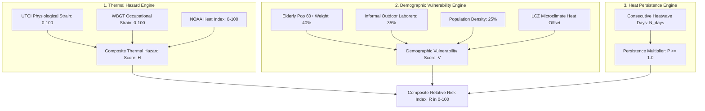

# Risk Methodology & Scientific Formulation — ThermoShield India (SIH26083)

This document provides the complete mathematical and biometeorological specification for thermal hazard quantification, demographic vulnerability weighting, heatwave persistence modeling, and relative heat-health risk classification in ThermoShield India.

---

## 1. The Tri-Factor Risk Conceptual Framework

ThermoShield India operationalizes the disaster risk framework established by the **Intergovernmental Panel on Climate Change (IPCC SREX / AR6)**:

$$\text{Risk} = f(\text{Hazard}, \text{Vulnerability}, \text{Exposure / Persistence})$$

---

## 2. Physiological Thermal Hazard Indices

### 2.1 Universal Thermal Climate Index (UTCI)
The Universal Thermal Climate Index is based on the **Fiala 6th-order multi-node human thermoregulation model** (COST Action 730 / Bröde et al., 2012). It calculates the equivalent ambient temperature of a reference environment producing the same dynamic physiological response (sweating, shivering, skin blood flow, rectal core temperature):

$$\text{UTCI} = T_a + \Delta \text{UTCI}(T_a, v_{10m}, e_a, T_{mrt} - T_a)$$

Where:
* $T_a$ = Dry-bulb air temperature ($^\circ\text{C}$, valid range: $-50^\circ\text{C} \le T_a \le +50^\circ\text{C}$)
* $v_{10m}$ = Wind speed at 10m height ($m/s$, valid range: $0.5 \le v_{10m} \le 30.3\text{ m/s}$)
* $e_a$ = Water vapor pressure ($\text{hPa}$, derived from relative humidity $\text{RH}$ via Magnus-Tetens equation)
* $T_{mrt}$ = Mean radiant temperature ($^\circ\text{C}$)

#### Water Vapor Pressure ($e_a$):
$$e_s(T_a) = 6.112 \cdot \exp\left(\frac{17.67 \cdot T_a}{T_a + 243.5}\right)$$
$$e_a = e_s(T_a) \cdot \frac{\text{RH}}{100}$$

#### UTCI Stress Categories:
| UTCI Range ($^\circ\text{C}$) | Thermal Stress Category | Physiological Meaning |
|:---|:---|:---|
| $> +46$ | **Extreme Heat Stress** | Severe risk of heat stroke, core temperature rapid rise |
| $+38 \text{ to } +46$ | **Very Strong Heat Stress** | High cardiovascular strain, rapid dehydration |
| $+32 \text{ to } +38$ | **Strong Heat Stress** | Moderate thermoregulatory strain, sweat rate $> 0.5\text{ L/h}$ |
| $+26 \text{ to } +32$ | **Moderate Heat Stress** | Minor discomfort for sensitive populations |
| $+9 \text{ to } +26$ | **No Thermal Stress** | Thermal neutrality |

---

### 2.2 Wet Bulb Globe Temperature (WBGT)
WBGT models occupational and athletic heat strain in outdoor environments under direct solar radiation (ISO 7243:2017 & Liljegren et al., 2008):

$$\text{WBGT}_{\text{outdoor}} = 0.7 \cdot T_{nw} + 0.2 \cdot T_g + 0.1 \cdot T_a$$

Where:
* $T_{nw}$ = Natural wet-bulb temperature ($^\circ\text{C}$, radiative-convective-evaporative heat balance of a wet wick)
* $T_g$ = Black globe temperature ($^\circ\text{C}$, radiative-convective heat balance of a 150mm matte black sphere)
* $T_a$ = Ambient dry-bulb temperature ($^\circ\text{C}$)

#### ISO / NIOSH Work-Rest Action Thresholds:
| WBGT Range ($^\circ\text{C}$) | Flag Color | NIOSH Regimen (Moderate Work) | Hydration Requirement |
|:---|:---|:---|:---|
| $< 27.8$ | **White** | Continuous normal work | $0.5\text{ L/h}$ water |
| $27.8 \text{ to } 29.4$ | **Green** | 45 min work / 15 min rest per hour | $0.75\text{ L/h}$ water + electrolytes |
| $29.4 \text{ to } 31.1$ | **Yellow** | 30 min work / 30 min rest per hour | $1.0\text{ L/h}$ ORS / electrolytes |
| $31.1 \text{ to } 32.2$ | **Red** | 15 min work / 45 min rest per hour | $1.0\text{ L/h}$ strict monitoring |
| $\ge 32.2$ | **Black** | **Cease all strenuous outdoor labor** | Immediate cooling access |

---

### 2.3 NOAA Heat Index (Apparent Temperature)
The Rothfusz 9-term polynomial equation (Steadman, 1979; NOAA NWS):

$$\text{HI} = c_1 + c_2 T + c_3 R + c_4 T R + c_5 T^2 + c_6 R^2 + c_7 T^2 R + c_8 T R^2 + c_9 T^2 R^2$$

With standard coefficients ($c_1 = -42.379, c_2 = 2.04901523, \dots$) evaluated for $T \ge 80^\circ\text{F}$ ($26.7^\circ\text{C}$) and $\text{RH} \ge 40\%$.

---

### 2.4 Composite Thermal Hazard Score ($H$)
The individual indices are normalized to $[0, 100]$ scales and combined via a calibrated weighted average:

$$H = w_{\text{utci}} \cdot S(\text{UTCI}) + w_{\text{wbgt}} \cdot S(\text{WBGT}) + w_{\text{hi}} \cdot S(\text{HI})$$

Default scientific weights:
$$w_{\text{utci}} = 0.45, \quad w_{\text{wbgt}} = 0.35, \quad w_{\text{hi}} = 0.20 \quad (\Sigma w = 1.0)$$

---

## 3. Demographic Vulnerability Index ($V$)

Census 2011 Primary Census Abstract (PCA) indicators are normalized per municipal ward:

$$V = 100 \cdot \left( w_{\text{eld}} \cdot \tilde{P}_{\text{elderly}} + w_{\text{lab}} \cdot \tilde{P}_{\text{laborers}} + w_{\text{den}} \cdot \tilde{D}_{\text{pop}} \right) + \Delta V_{\text{LCZ}}$$

Where:
* $\tilde{P}_{\text{elderly}} = \frac{\text{Elderly } 60+ \text{ Pct}}{30.0\%}$ (capped at 1.0, weighted at $0.40$)
* $\tilde{P}_{\text{laborers}} = \frac{\text{Outdoor Workers Pct}}{50.0\%}$ (capped at 1.0, weighted at $0.35$)
* $\tilde{D}_{\text{pop}} = \frac{\text{Density}}{25,000 \text{ persons/km}^2}$ (capped at 1.0, weighted at $0.25$)
* $\Delta V_{\text{LCZ}} \in [0, 10]$ = Microclimate heat retention penalty based on Local Climate Zone classification (e.g. LCZ 1 Compact High-Rise: $+8$, LCZ 2 Compact Mid-Rise: $+6$, LCZ 9 Sparsely Built: $+1$).

---

## 4. Heatwave Persistence Multiplier ($P$)

Consecutive days of extreme heat compound human physiological strain and nocturnal heat retention:

$$P = 1.0 + \min(0.20, (N_{\text{days}} - 1) \cdot 0.05)$$

Where $N_{\text{days}}$ is the count of consecutive days where $T_{\max} \ge 40^\circ\text{C}$ or $\text{UTCI}_{\max} \ge 38^\circ\text{C}$.
* Day 1: $P = 1.00$
* Day 2: $P = 1.05$
* Day 3: $P = 1.10$
* Day 4: $P = 1.15$
* Day 5+: $P = 1.20$ (capped at $+20\%$ amplification)

---

## 5. Composite Relative Heat-Health Risk Score ($R$)

The unified ward relative risk score is calculated as:

$$R = \min\left(100.0, \left( w_H \cdot H + w_V \cdot V \right) \cdot P \right)$$

Default baseline weights:
$$w_H = 0.60, \quad w_V = 0.40 \quad (\Sigma w = 1.0)$$

### 5.1 Risk Tier Classification
| Risk Score ($R$) | Risk Category | Color Code | Action Required |
|:---|:---|:---|:---|
| $0.0 \le R < 26.0$ | **Low Risk** | 🟢 Green | Normal routine, standard hydration awareness |
| $26.0 \le R < 51.0$ | **Moderate Risk** | 🟡 Yellow | Advisory issued for elderly, shaded rest for outdoor workers |
| $51.0 \le R < 76.0$ | **High Risk** | 🟠 Orange | Municipal cooling shelters opened, strict work-rest schedules |
| $76.0 \le R \le 100.0$ | **Extreme Risk** | 🔴 Red | High-priority emergency alerts, suspension of outdoor manual labor |

---

## 6. Scientific Limitations & Disclaimers

> **IMPORTANT SCIENTIFIC DISCLAIMER:**  
> The Composite Heat-Health Risk Index ($R$) is a **relative spatial prioritization metric** intended for early warning and municipal resource dispatch. It does **not** represent a clinical prediction of individual medical morbidity or absolute statistical mortality. For clinical protocols, refer to the **NCDC National Action Plan for Heat-Related Illnesses (2024)**.
